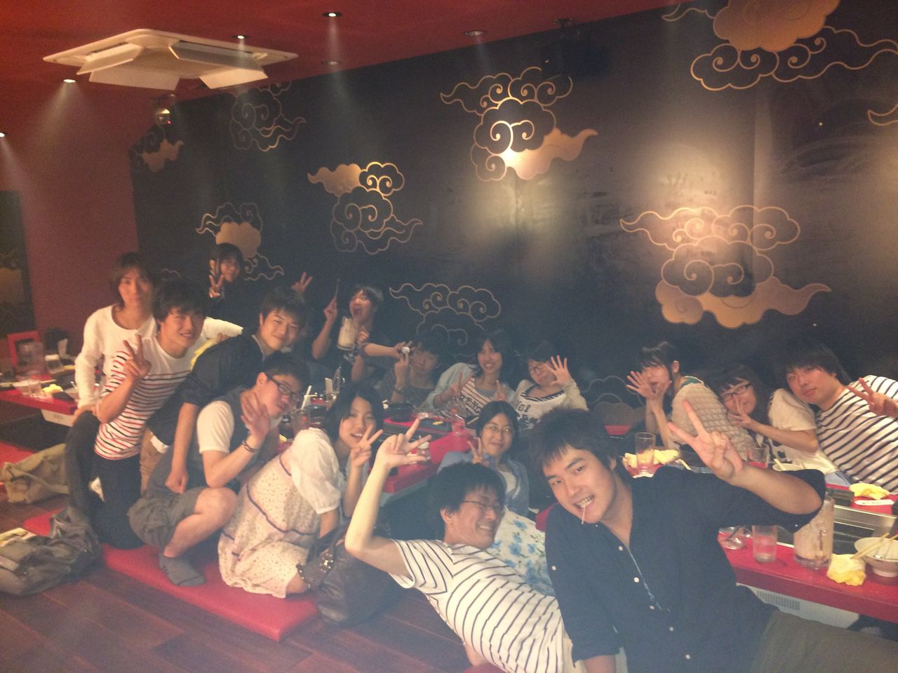
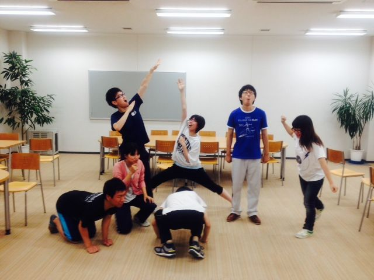

こんばんは、打ち入り幹事やらせて頂いた茶谷です。

本日は稽古は休みで話し合いでした。

演出のチャーリーさんの熱い思いをチーム一同感じ、ピリリと一段空気がしまりました。

これからの稽古が楽しみです。

一回生の成長と共に、僕も成長していきたいと思います。

まずはテストを乗り切らないとなー^o^

あと肉は美味しかったです。^o^

P.S.うちのチームに現役生カップルの殆どが集まってるのは故意ですか？

## 雨男

今日も今日とて雨ですね、今回の芸名はレインマンのユーリです。

夏に入ったというのに肌寒い気候が続いてなんとも言えないもどかしさを感じます。さっさと猛暑の中ランニングとかしたいもんですね！！

さてさて、今日は演出のチャーリー君が回生で旅行に行っており延期不在の稽古でした。

ということで実は演出補佐の僕仕切りで稽古をしました！シーン回しとかはせずに、発声とか基礎練を超入念にやりまくりした！汗だくでしたね、しかしまだまだいけるはずです皆！

また、稽古後はぼーっとお芝居する上でしなきゃ駄目なこと、みたいな座談会しました。感覚でやる僕には説明が難しかったですね(。-\_-。)

しかし3年前の自分を見ているかのような気分で、成長していく姿を最後まで見届けたいところですね！

写真はポートレートの写真です。お題は「クレヨンしんちゃん」です(=゜ω゜)ノ

p.s.チャーリーチームの役者のアルゴ君が主催する「舞礼講」というユニットが「サマータイムマシンブルース」をオーバルシアターで公演してます！万OB勢からしてみれば、少し懐かしい脚本ですね。お暇があれば是非是非見に行ってみてください！
