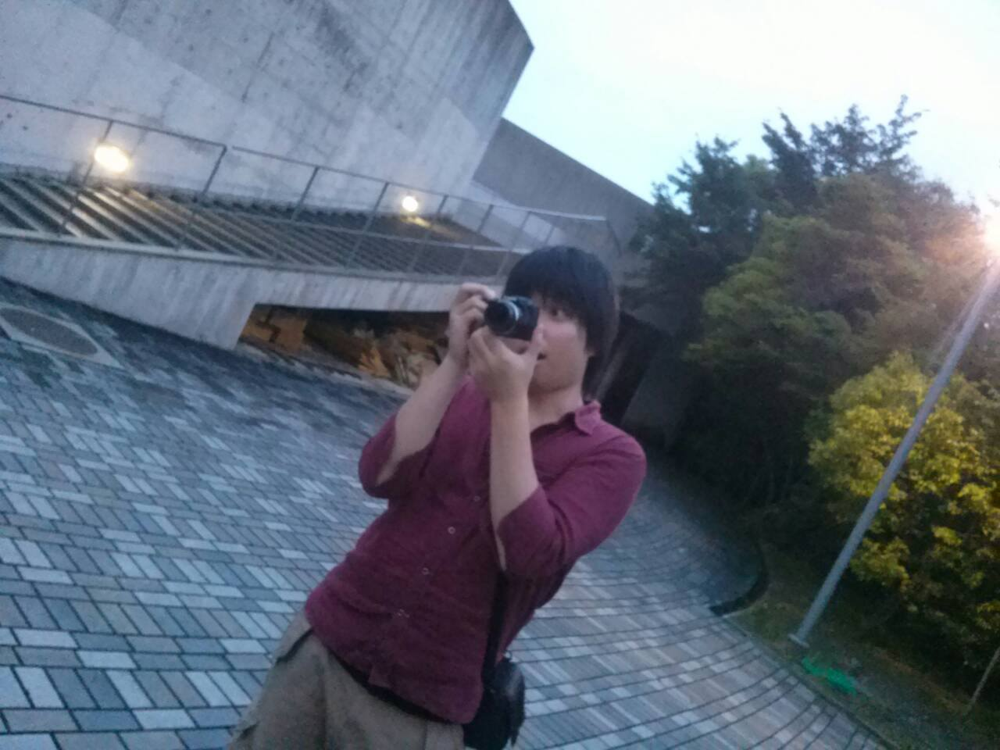

週4は青い服着るようになった、二回のさとしです！

もう一回からは、青＝さとし、という認識で覚えられてます!いやぁ、無事に覚えられて嬉しいっすね( ；∀；)

今日も教職があって最初から稽古に参加できません…、ただでさえ滑舌崩壊してるのに…(´・ω・\`)

今日の稽古ですが、段取りでもなかなか体現するのが難しくて一回に限らず上回もけっこう苦戦してます…

でも、まだまだ稽古は始まったばかり！

楽しんでいこーぜ(\*´∀｀)

…って感じで頑張っていこうと思います!!

今日の写真は、我らTS.revolutionの音響チーフ、くまさんが写真を撮ってる写真です

なぜか新鮮な感じがします(・・;)
