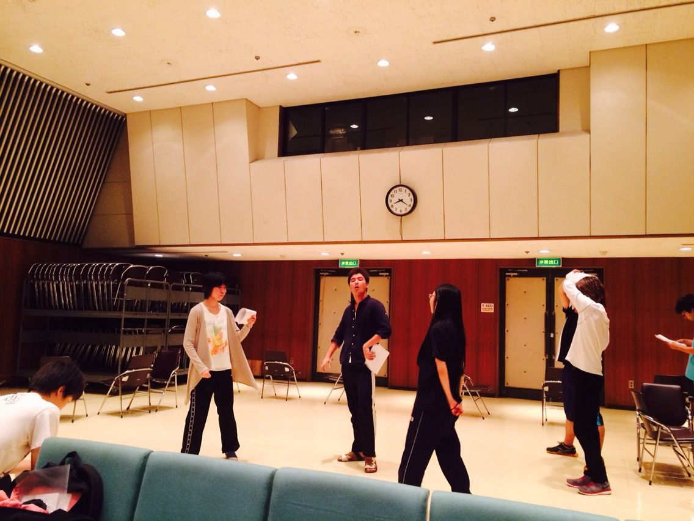

関西大学はテスト期間中、しかしT.S.Revolutionはまだまだ稽古！中国語のテストを終えた一回生のジミーです。

今日は高槻のふれあい公民館、地下大ホールで練習させていただきましました。やっぱり広い。なんといっても広い。ホール手前の舞台でやるエチュードは少し？火傷しましたが新鮮でした。

写真はシーン回しの風景。どこのシーンかは言えませんが役者から溢れる熱量を感じ取っていただければ幸いです。因みにこの後すぐに僕の出番でした(右の奥に写ってしまってるのが僕です。)

稽古もテスト勉強も大変ですが、どちらも最高の結果を残せるよう頑張ります。

ではでは、次回もジミーと一緒に…レリーズ！！
