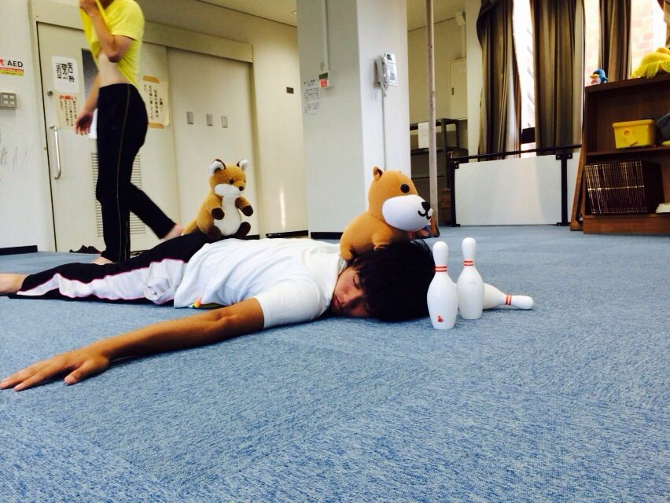

まだまだテスト期間真っ最中！あと、テストが5科目もあるみつあみです。

今日は、一通り基礎練習をした後にシーン回しをしました。2人エチュードとかをやっていると、自分が面にでないなと感じてしまいます(^^;;自分が話している時に面にでることは目立つ上で大事なことなので、しっかりと意識していこうと思います！

あと、ふれあいプレイルームで初めて練習しました。そこで学んだことがあります。それは、「カーペットでは靴下で練習してはいけない」ということです！特にアメンボダッシュは危険です！滑ります！思いっきり滑りました！←

今日はOBさんたちも来てくださいました。指導や差し入れありがとうございました！

写真はぬいぐるみと戯れてる？茶ぱつさんです（笑）
