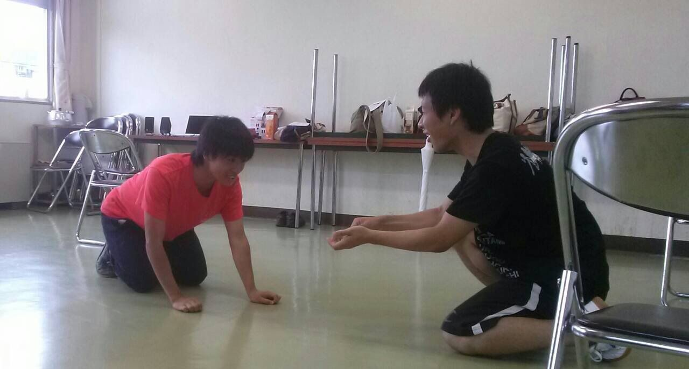

## 富田公民館にて！！

今日ジミーに夏バテ気味じゃないかと言われた一回生のもっさんです！そんなことはないと信じたい…

テストも全部終わり 夏休みに入りました！！初の万での夏！！！

おもいっきり楽しみ(稽古頑張り)たいです！(??????)??

さてさて、今日は一言エチュードなるものをやりました！

普段言葉で他の人にあれやこれを伝えるのに 一言の言葉だけで 伝えるというのは 思いのほか難しく 表現の難しさを改めて痛感しました…。

写真は二人エチュードで茶ぱつさんと さとしさんでお題「猫の溜まり場」です。 猫です 猫 ！猫ですよ！

ではでは夏の暑さに負けない勢いで 頑張っていきましょー！！！

＼＼\\\\?( 'ω' )? //／／

明日の高槻祭り楽しみです！！
