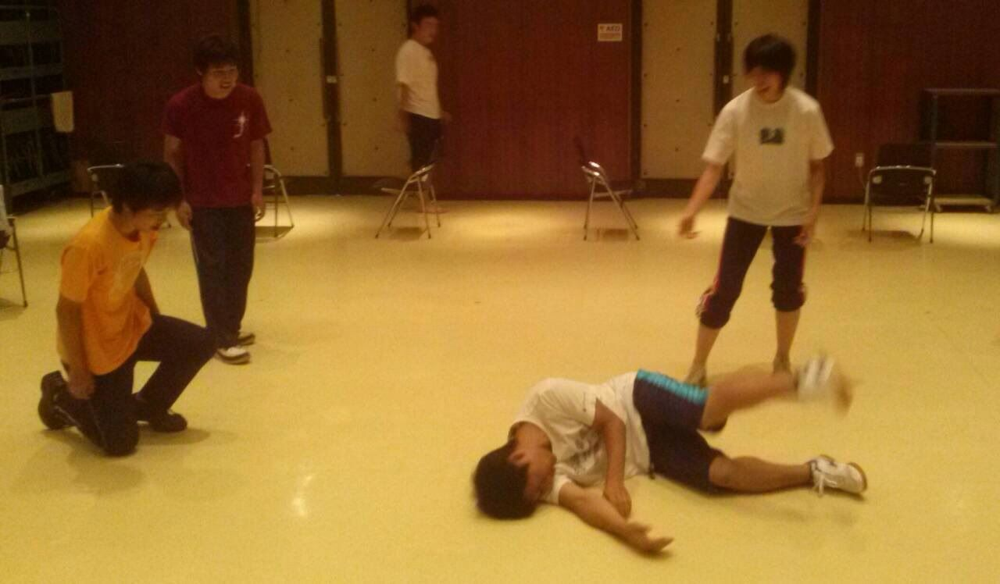
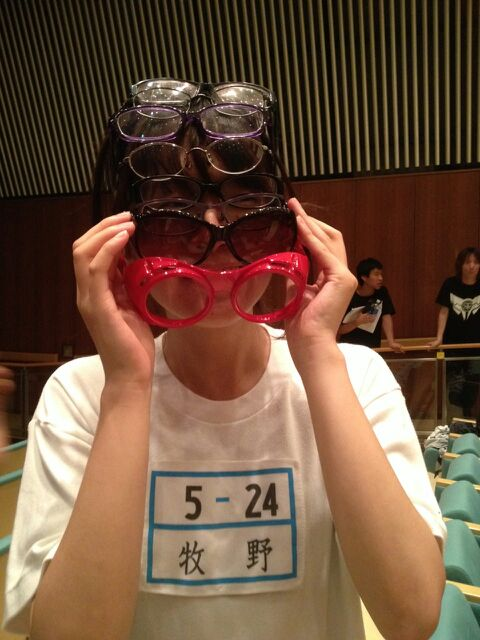

こんにちは、最近髪を染めまして、お盆の派遣に入れるかどうか不安のジュークです。

昨日はエンディングとオープニングの練習をやりました。

いろんなアクションがあるので、役者として参加でき、本番とても楽しみにしています。

そいや、この三日間和歌山の方へキャンプに行ってきました。僕自身も二年ぶりの参加で、「夏だね！」って感じがしました。帰りは和歌山から大阪まで4時間くらい

運転しまして、一番の不安要素だったですが無事帰って来れました。

おそらくこれが大学生活最後のキャンプになるかもしれないのでさびしいなぁ～

来年もＯＢながら勝手に乱入しよかなｗ

さいごに、今回の稽古場の写真はエチュードです。お題は「てけてけ駆除大作戦」。

さとしっすが倒れています。大丈夫っすっか？大丈夫っす！さとしっす！

ではでは。

## 通しでしたよ！

みなさんこんばんは！

3回生のアイルです。

他チームがキャンプを楽しんでる中、我らは通しをしておりました！

久しぶりの稽古場でどんな感じになってるのかなーって期待してきたんですが、みんないい感じに成長してますよー！

一回生は言わずもがな上回生もいろいろと頑張っていて、見ていて楽しかったです！

そしてなんと！今日はOBのザキさんとゴミさんが遊びに来てくださいました！

残念ながら写真は撮り逃してしまったんですがいろいろと教えていただけてとっても勉強になりました。ありがとうございます！！

そんなこんなでドタバタしている夏ですが、みんな悔いのないよう頑張ってほしいです！もう言ってることがおばちゃんですね！泣きそうです！

写真は無限サングラスぱぴーです。素敵なおしゃれですね！！！
