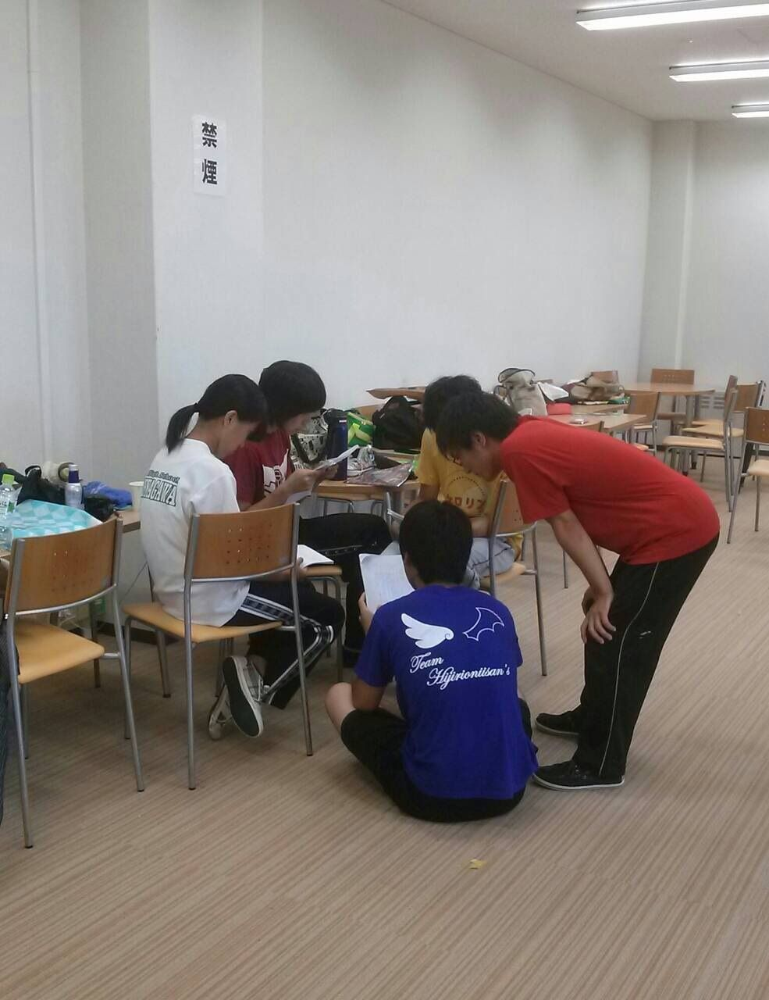
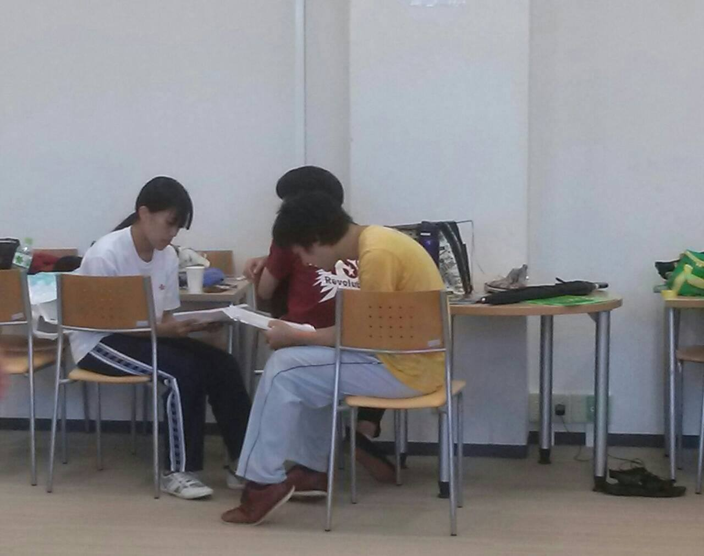
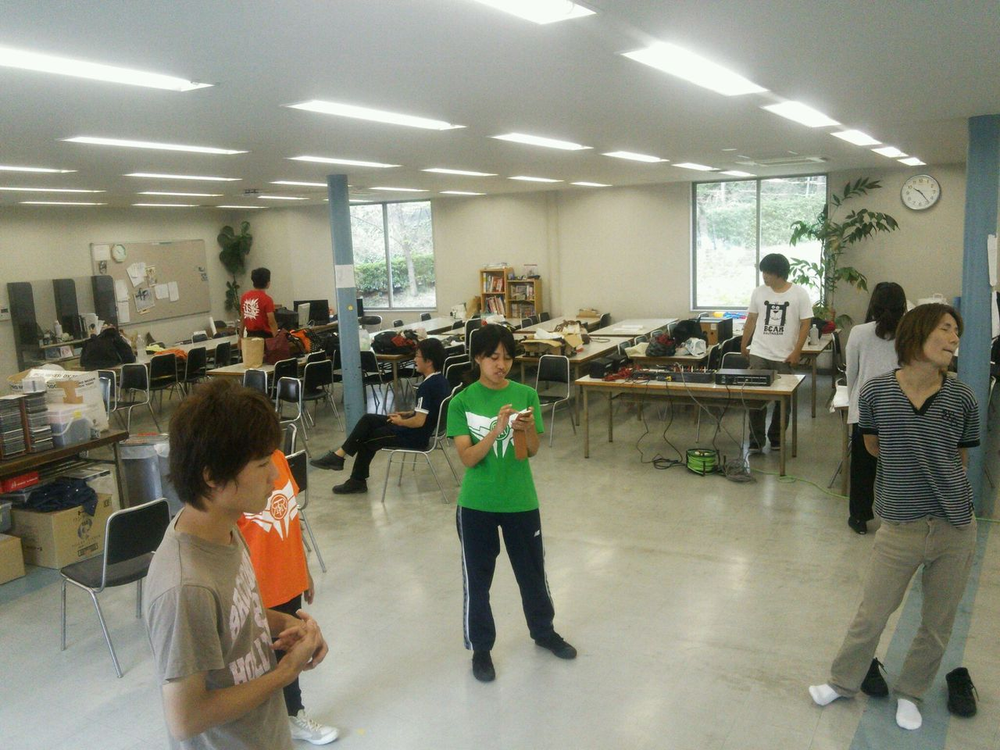

皆さんこんばんはー

今宵のライター、八ツ橋結こと茶谷です。

稽古も残すところ一日ですねー

今年の夏はあっという間に過ぎてしまいました。

前回ブログを書いたときから一ヶ月近く経ちますが、一回生の演技の上達が素晴らしいです。

僕も負けないように頑張るぞーという意気込みで本番を迎えたいと思います。

では今日も最後の稽古頑張ってこー

## ラスト稽古じゃーい

どうも、最近何故か生傷が絶えない散葉です。

主に虫さされのかきむしりと靴擦れかな？

皆さん投稿時間を見ればお察しかと思いますが、

……昨夜寝落ちしました。朝って爽やかで良いですね←

そんなこんなで明日は素晴らしいことに仕込みです。

つまり今日は最終稽古です。

予定では通し稽古をする予定です。

チームもとうとうクライマックスに突入してきましたが、

我々は緊張感になんか負けずに、むしろ楽しんでいきたいと思います！

チャーリーチームのモットーは「疾走感」。

本番まで、最後まで、全力完走してやりますよ！！

写真は、お互いに話し合う一回生の姿です。

頑張れ、少年少女よ！

## 最後の通し!

おはようございます！二回のさとしです

最近、劇での滑舌はよくなってきましたが、その分日常会話の滑舌が崩壊しております( ；∀；)

さてと、今日は夏公最後の稽古で、最後の通しです

一回生から四回生までもれなくやる気満タンです

そんな彼らにちゃんとついて行けるように僕も全身全霊で頑張りますっ!!

他のチームも喉枯れや風邪に気をつけて最後の稽古頑張ってくださいね!!

写真は、通し前の風景です
