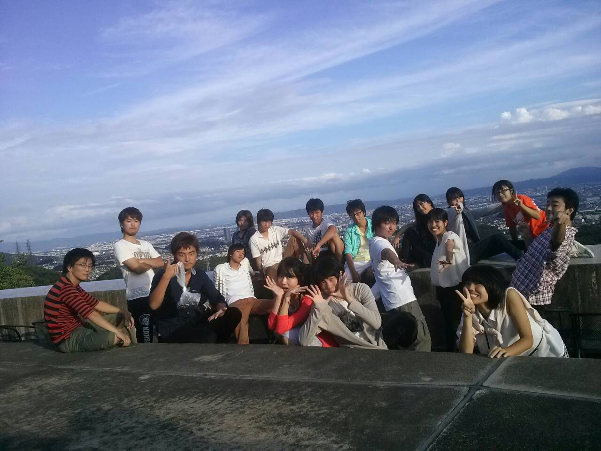
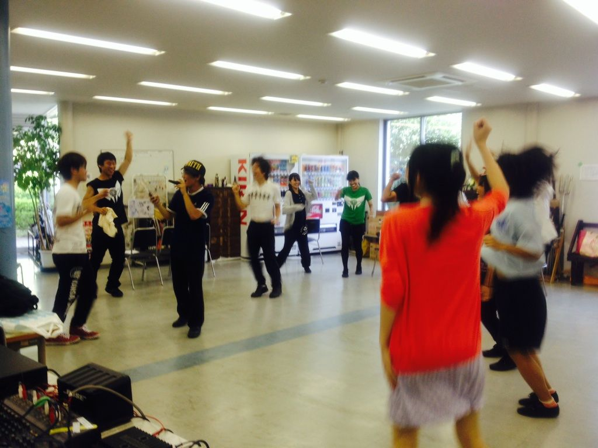

夜分遅くに失礼します。一回生のジミーです。

T.S×Revolutionの稽古が昨日で終了しました！

思い返すと6/27のチーム発表から今日まで全力で走り抜けてきた2ヶ月間。

何度演出さんに「ちょっと違うな」と言われたり、無茶な動きをしてたり怪我したり…でもその分だけ成長できたと信じています。

本番まであと3日。本番で最高のパフォーマンスをお届けできるようメンバー一同精進します。

ちなみに写真は稽古後テラスで撮った写真です。どうですか？これが自信に満ちた役者・スタッフの顔です！

ではでは喉にお気を付けて(いやほんとに)。一回生のジミーでした。

## 仕込み一日目

お疲れ様です！今日のブログ担当のユーリです！！

今年で最後の夏公仕込みということで、今までの仕込みの経歴を思い出してみると…台風(公演中止)やら地震やら火事やらやら、災難続きの仕込みですね。

僕がいる限りは災難が降り続くんでしょうね。ごめんね後輩ちゃん達。

そんなこんなで今日の仕込みは予想通りの大雨でした。ツイッターでの現役生やOBOGさんからの僕への罵倒ツイートが一杯でした。感無量です。

しかしまぁなんだかんだで雨も上がり、結果的には怪我人とかもなく無事に終わることができました！！明日からのゲネプロや本番も頑張っていきたいですね！！

さてさて、本番2日前のこのブログを何故僕が書いているかと言うと、実は舞台監督と演出補佐をさせていただいてるからなんですね。2年前の夏では劇団雨男の演出として、皆で切磋琢磨して作品を作り上げたのが遠い思い出のように感じます。

あの時一回生として育てたチャーリーが、今では演出として皆の陣頭指揮を取っていると思うと、とてもむず痒い気持ちになります。

4回生達は自分達らしくふんわりやりながらも後輩の面倒を見ていて、3回生達は後輩達をちゃんとしっかり見てあげながら努力して、2回生達は自分なりの精一杯をこなしながらも先輩らしくあろうと頑張っていて、1回生は1回生なりに先輩に全力で食い下がってきていて。

今年のチームは4年間の夏チームの中で一番楽しくてしんどくって(体力的に)、終わって欲しくないなぁーと思うチームです。

とまぁこんなしんみりしたこと語っていてもしょうがないですので！ともかくうちのチームは最高のメンバーが、最高の出来の、最高の熱さを、最高に演じて、最高の感動をお客様に与えます！ハードルを上げるだけの自信が僕らにはありますよー！！

ではでは8/30に皆様お会いしましょう！！最前列は汗と唾が飛び散るかもなのでご注意を！！

以上、仕込み打ち上げでほろ酔い状態の、雨男ユーリでしたー！

写真は昨日の通し稽古前に、4回生のまさお君がcolorsのカラオケをしている様子です。皆ノリノリですねー＼(^o^)／
