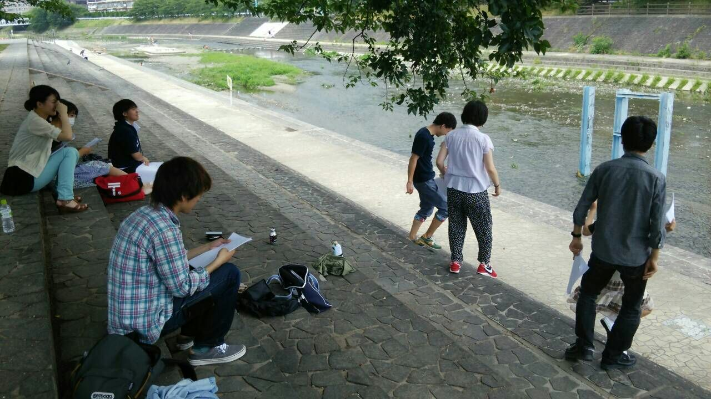

こんばんは！うみです。

この夏の役職は、役者・衣装チーフ・小道具です。

小道具は、上回生が居なくて経験者も少ないので頑張ります。

衣装は同期のみということで、いろいろと遠慮せずいこうと思います(微笑)

あれっ、どっちも上回生いないのか。私、先輩か。うみ先輩なのか、と思います。えっ不安とか言わんといて←

君恋は今日も役者選考！

最初は河原で稽古。途中から雨が降ってきて下宿民の家に移動しました。

河原での選考のとき、一度だけ立って台本を読みました。

体で表現しようとし始めるとテンションも自然と上がるし、めっちゃ楽しかったです！

雨が降って移動した下宿民の家とは、我らが座長・キャサリン先輩の家。

選考終わりに少し皆でだらだらさせて頂きました。

チームメイトと下宿民の家で目的もなくだらだらするの楽しいです。

今度は目的もってだらだらしてみたいですね。キャサさん、よろしくお願いします(笑)←

役者選考も明日で終わり。明後日は打ち入りで役者発表！楽しみです！

