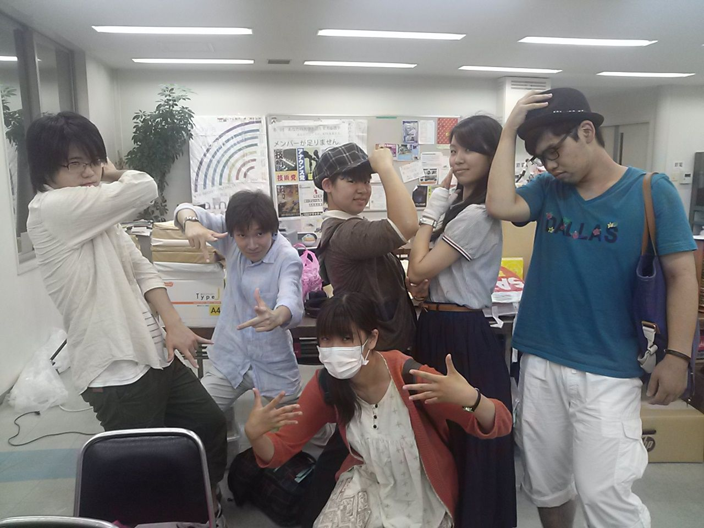

※タイトルに意味はございません

こんばんはー！他チームさんの今日のブログがお二つとも一回生紹介なのに対して、二回生のあきらです。まだやってない一回生紹介、お楽しみに！

っとそこで終わるわけにもいかないので続きを...

今日は基礎練からの台本稽古でした。

【基礎練】

7坊主を負け抜けでやっていったのですが、勝者はくみちょーさんでした！さすが四回生ですね(\*´∀\`)

次は負けないよう頑張ります！ ちなみに今回のエチュードは皆、事故なくおもしろかったです♪

【台本稽古】

段取り再確認しつつぐるぐるシーンまわしていってます！

このシーンこんな小道具いるんやー、とかこのタイミングでBGM入るんやー、とかとか。各役職的にも実のある時間でした(\*´ω｀\*)

どんどん成長していく一回生、今後も今も期待です！！

さて明日は球技大会！無事みんな怪我なく楽しめますようにヽ(・∀・)ノ

P.S. 写真は一回生集合写真です！みんなあらゆる意味で強いです(確信)
