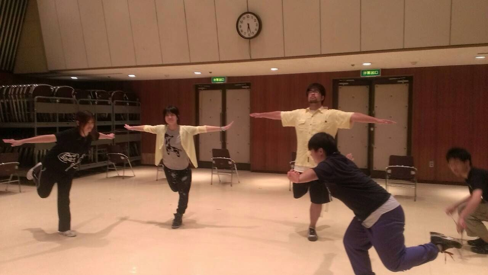

こんにちは。

三回生、グルメです。

早いものでもう三回生です。

というコメントを毎回しているので割愛します。

稽古場で一回生が頑張ってそれを上回生が支える、こういう景色をみると、いやー夏だなぁとしみじみ感じます。

二回生ももう上回生なんですよね、初めての後輩との稽古の中で彼らがどのように成長するか、楽しみです。

後輩の成長も気になりますが、私達三回生、四回生も学ぶことは沢山あるはすです、全ての回生が回生毎に色々悩んで、結果、万絵巻全体がもっと良くなればいいなと思います

回って漢字が多かったですね...

そんなこんなで夏公演楽しみです。

## あらどおしっ！！

どうも、ゴーストタイプ、有吉です。

という訳で、ガチ死亡説がまことしやかにささやかれているわたくし、有吉が今日稽古場に参上いたしました！今日の稽古は荒通しでした。ザッと全体の流れをつかんで少し次のステップに進めた感じがしますね！とはいっても夏公演はまだまだ始まったばかり！頑張っていきましょう！僕も頑張ります！

写真は⊂二二二（　＾ω＾）二⊃ブーンの練習の様子です！(僕は7時くらいに稽古場に着いたので実態は不明)
