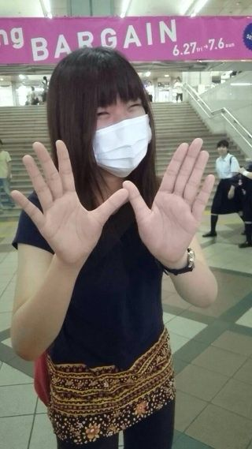

どうも、1回生紹介第5弾！ということで、今回は我らが【わじー】をご紹介したいと思います！

名前の由来は

12月12日生まれ

↓

ワンツーワンツー

↓

ボクシング

↓

輪島功一

↓

わじー

だそうです

私も昨日知りました

へえー

わじーはなんか面白いので、同回生だけでなく先輩からも人気を集めております！

そんなわじーのキーワードは

?みかんの皮

?ポスト

?わじらーの会

これだけ聞いたらなんのこっちゃですね！

ここでは敢えて詳しくは述べませんので、わじーとの会話のきっかけにでもしていただければと思います！

写真は1回生いちおしのわじーショット！

マスクとポーズがわじーをうまく表現しているとかしてないとか……

以上、きほでした！
