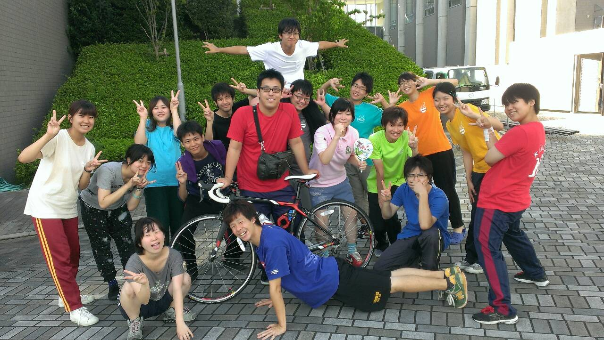

こんにちは。ついにブログの担当が回ってきました…:(；ﾞﾟ'ωﾟ'):

1回生のエーデルです。

なんと昨日に引き続き、今日も我らが演出冬花さんがお熱でお休みでした。

みんなとても心配しています(；´Д｀)

流行っているようなので皆様もお気をつけください。

さて、稽古についてのお話を！

今日は基礎練をTS×Revolutionと合同でしました！

久々に見る顔も多く楽しく練習しました╰(\*´︶\`\*)╯

他のチームがどのようになっているのかも気になるところです。

我々も頑張らねばと実感できました٩(๑òωó๑)۶

お昼休みをはさみ、午後からは自主練を中心に練習しました。

中には解散後も居残り練習する強者もいらっしゃいました！！

そんな中、OBのみゅうぽんさんがいらっしゃいました。

自転車がとてもかっこいいですね！

写真はみんなでにっこにっこにー♪

私はラブライバーじゃないのであまりよく知らないのですが…笑

さて、本番までの日数も少なくなってきました。

もうすぐ『君が恋した“10日間"』に突入します！

風邪に気をつけて残りの練習も頑張りましょう！
