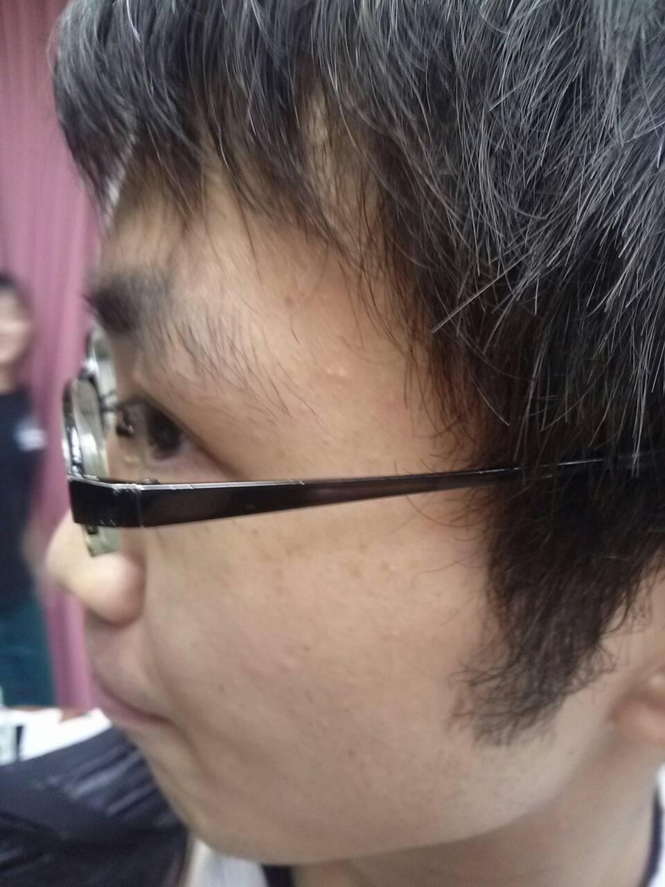

ビューラーを使って睫毛をあげると、見える世界が明るくなるって言うけど…あれ、本当なのですね。比喩だと思ってました。

影を落とす物が変形して、物理的に明るいです。

今日、下宿先にミニドーナツが作れるフライパンが届いてテンションが高いうみです。

たこ焼き機のように、ドーナツの型があるフライパンなのです。

生地を流し込んで焼くだけで、ドーナツを作れるのですよー♪

これがあればドーナツの形のお好み焼きだって作れるのです！

はやく作ってみたいです♪

IH対応です！

前置きが長くなりましたが、

今日は、17期生の課長さんが稽古場遊びに来て下さいました♪

社会人になられても、変わらずツッコミが上手くて、とても楽しかったです♪

加えて懐かしさでほのぼのしました(\*´ー｀\*)←昨年の夏公課長さんチーム主人公

なんとしても今年の夏公で、成長した姿を見せたいですね。

写真は、今日の課長さんです。この角度このドアップさの写真、三枚くらい持ってる気がします
