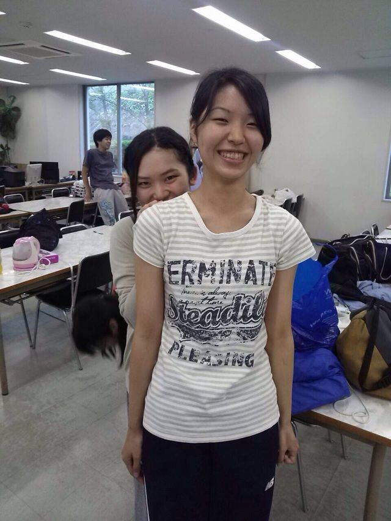
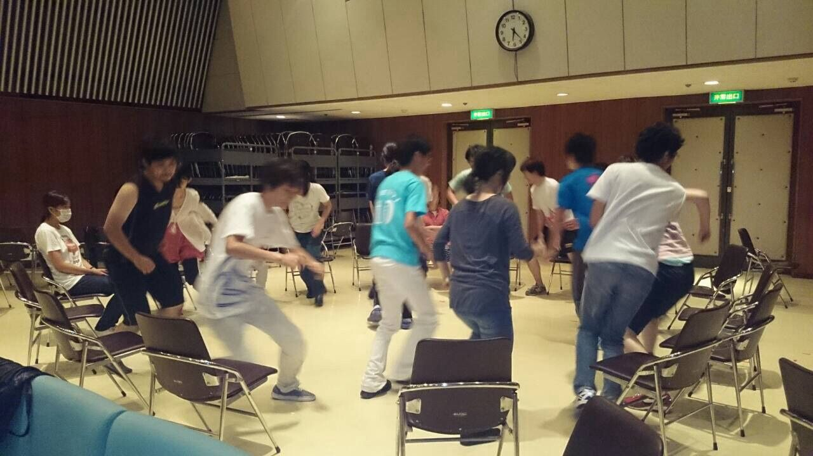

おはようございます＊

ブログの更新2日サボってました

ごめんなさい(；ω；)

一昨日はドレリハをしました！

ドレリハの時は毎回言ってますけど、

衣装を着ると気合いがはいります！

今回の演目は衣装替えが多くあるので、

演技はもちろん衣装にも注目していただきたいです！

さて、衣装といえば…

17期のともかさんが稽古場にいらっしゃいました～！！(\*´ω｀\*)

本番はお仕事で来られないとのことで残念ですが、お仕事頑張って下さい！ありがとうございました！

写真は早速1回生のエーデルと仲良くなったともかさんです！

それではこの辺で( ´・ω・)ノ

きほでした＊

## サイゴノケイコ

４回生のくみちょーです。

今日は稽古最終日でした！

明日から小屋入りです！

あさ9時からよる9時まで、

一日がすぎるのがとても速かったです。

夏公演も明日から猛スピードでおわっていくんでしょうね。

個人的に早く本番を向かえたいです。

わくわくしてます。稽古楽しいです。

君恋チームは11:30の一番手！！！

自分たちのお芝居をするのはもちろん、

他のチームの頑張りや成長も楽しみにしてます！

お腹いっぱい胸いっぱいにして

終われる自信があります！

写真は最近流行中のフルーツバスケットです。

それでは、ご来場お待ちしております。
