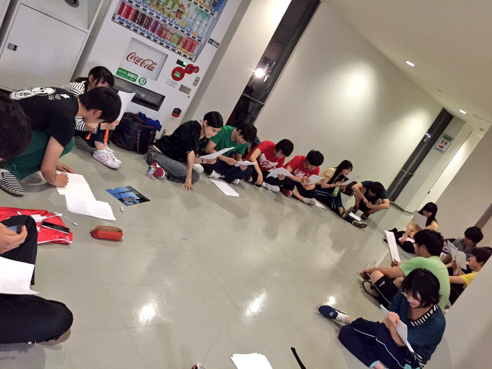

ども、傘を持ってる日に限って雨降らない。3回生の出雲です。

逆に傘を持ち歩いたら晴れさせられるんじゃないかと誰かがポツリ、天才か。

明日晴れて蛍見れたらなー(・・;)

暑いけれど稽古は長ジャージ、半ズボンの同期が虫に刺されまくってました。山の上の欠点です(´・ω・\`)

さてさて、今年も夏公が始まりまして、うちのチームの熱量は他を圧倒する強さ！

蒸し暑ささえも吹き飛ばすような稽古場、演出が言ったように全力で楽しみ尽くそうと思います！！！

写真は役者選考です。真ん中の赤い二人は兄弟かなんかでしょうか？
