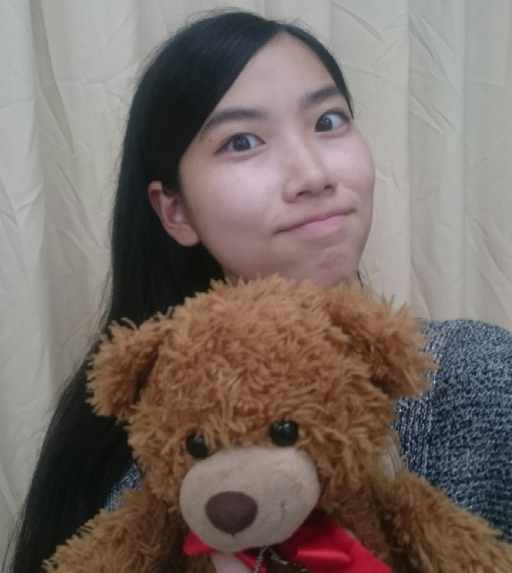

お疲れ様です、おはこんにちこんばんは！

名の如く会長らしい会長から

"そして次の一回生はなんとあの...！！"

なんてがっつりハードルあげられながら

ごっついバトンを引き継ぎました、

"あの" ベ ル です、お見知りおきを！

￣￣￣

自己紹介。って、一体何処までの情報を

公言すれば良いのか難しいですよね。

ずぇんぶ言ってしまえば長すぎるし、

少しだけでは記憶に留めて頂けないし。

なので、私なりの書き方で参ります。

お菓子片手に読んでやって下さい！

先述の通り、初めましてベルです！

写真にうつっている人間が私です！

そしてカメラ目線から逸らしている熊が

入学式から一緒のビュッフェ(♂)です！

因みに芸名の由来は、

好きな漫画を問われた時咄嗟に

ベルサイユのバラと答えたからです。

TC祭では役職は役者と大道具、

役柄は五月病君の同期・ヤマモトとして、

可食物カッターのエジキになったり、

即席ヒーローの青色に扮したりしました！

夏公も引き続き同じ役職をやらせて頂きます。

めいっぱいいっぱい頑張りますので、

うまれたての足ぷるぷるな鹿を見守るよに

温かい目をして下されば幸いです！

今日の活動報告もしますっ！

積み重ねが地を作るであろう基礎練からの

笑いあり反省ありのエチュードからの

ブ レ ス ト でした。

(響き格好よくて震えます。)

一人では定まらなかった登場人物達の

イメージが確固たるものになっていき、

まるで実在している方々の話をしている

ような不思議な気分になりました！

また、アツく意見交換しはる先輩方を見て

いずれは私もこんな風になれたらなと

思いを馳せてもいました…！

本当に、尊敬です。

先輩方は勿論、同回生達にも。

明日はこのブレストを踏まえての稽古。

各々がより劇に、役に入り込んで、

ぶっ叫んでいきはるんだろうなぁと

ブログを書きながらとても楽しみです！

ああ、私の夏、

ねぼすけ一色に染まります！

ヴ、遅刻はしないよう励行しますが。

(スゴくタイムリーげふんげふん)

ば、バトンタッチ！

次の一回生はまさかのあの…！！
