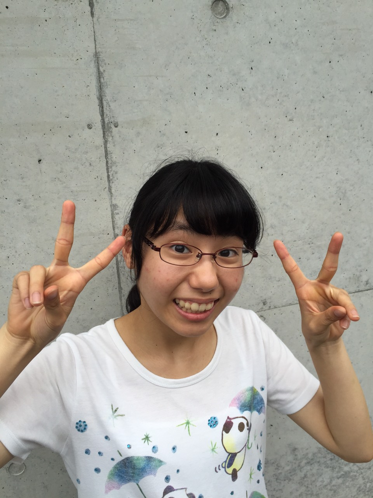

はじめまして！

月曜から寝ぼすけチームの一回生紹介ラストを飾ります、DJかおりです！

あだ名は某有名人とは何の関係もありません。ごめんなさい…。(笑)

それでは早速ですが自己紹介を…

改めましてDJかおりといいます！TC前座では音響をさせていただきました。

今回の夏公でも音響を頑張りたいと思います！

役者はしませんが、他の一回生に負けぬよう稽古がんばります！！

音楽を聴くことが好きです。歌うのも好きです。

そして前回のジャンヌ同様人見知りです。

いつも割とおとなしくしてて真面目に見られがちですが、そんなことないです。

ホントは先輩方や同期とわちゃわちゃし たいとか思ってます(笑)

先輩も同期もみんな大好きです！

そんなDJに是非かまってやってください。めちゃくちゃ喜びます。

そしてそして、本日の活動！

今日は万絵巻の球技大会でした！

競技種目はフットサルとドッジボール。

夏公のチーム対抗で優勝を競い合う暑い暑い一日でした。

あいにくの天気でしたが、そんなことはお構いなし！

みなさん元気いっぱい走り回っておられました(笑)

我が寝ぼすけチームのみなさんも開始前からテンションMAX！！

みなさんフットサルもドッジボールも上手でびっくりでした！

そして、気になる結果はななななんと……！！

寝ぼすけチーム の優勝です！わーい！！ヽ(\*´▽｀\*)ノ

そして、輝けるMVPは我らが会長でございます！！

血みどろになりながらよくがんばってくれました！(笑)

寝ぼすけのみなさん、そして他チームのみなさんもお疲れさまです！

月曜日からは夏公に向けて稽古再開です。

月曜から寝坊、なーんてことがないように、今日と明日ゆっくり休みましょう！(笑)

以上、睡眠時間が愛おしいDJかおりでした！
