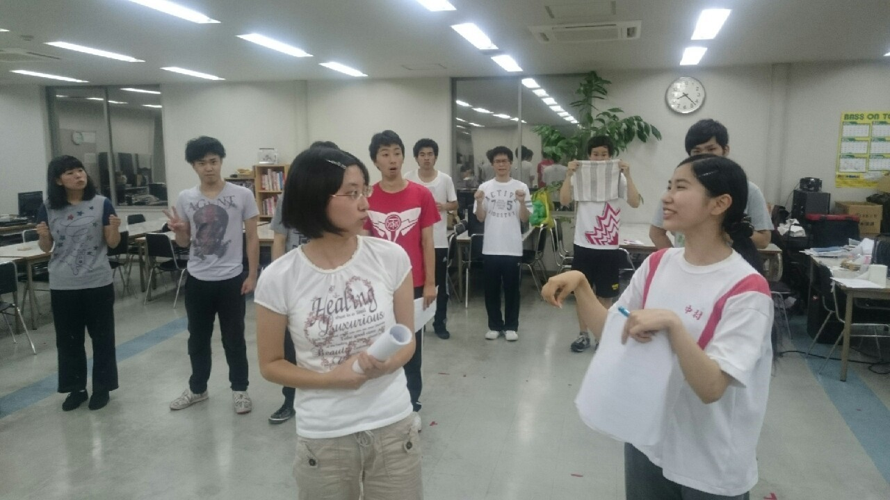
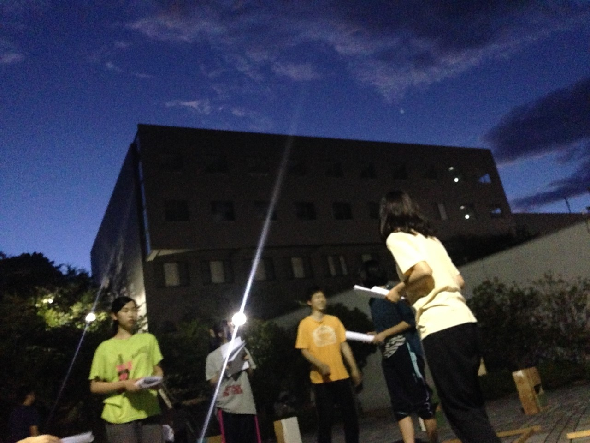

真夜中からこんばんは！

と書くつもりが寝落ちして今に至ります。

(結局課題全然進まなかった…)

三回生になりましたあきらです。

今年の夏も音響オペをさせていただきます！

さて今日は基礎練を三チーム合同で、そのあとシーン練に移りました。

基礎練中はまだ学校登れてなかったのですが7坊主とエチュードをしていたみたいです。

改訂版の台本印刷も終わりS棟に向かうとシーン練直前でした。シーン練は最初の場面を重点的に行いました。

締め切りはもう少し先なものの既に台本を外している人もちらほら。

このシーンもそうなのですが皆イキイキしてます！本番をお楽しみに！

そろそろ夏休み、キャンプや高槻祭り等のイベントもたくさんありますが、その前に立ち塞がるはテスト(とバイト)。勉学は学生の本分なんて言いますからね、頑張っていきましょう(´；ω；\`)

それでは！

P.S 今回の写真は稽古中の写真。夜王がこっち見てピースするシーンがあるとかないとか。

## 夏は寝ぼすけ

こんばんわ、最近自室のクーラーを開放して毎晩を快適に過ごしてます、夜王です。

月曜から寝ぼすけのブログは今考えたら初です。もうそろそろ１ヶ月が経つのに不思議な感じです。

それだけ更新が遅……なんでもないです。

さて今日も役者のみんなでシーン回しをしました。セリフもだんだん覚えてきて舞台で徐々に動けるようになってきて楽しいです！これからもっと面白くなるように精進ですね。

注目すべき一回生たちもがんばってます！発声やセリフの読み方などわからないことだらけなのに工夫をしたり、先輩にアドバイスを求めたりと日々成長していく彼らを見てると僕もうかうかしてられないなという気持ちになります！

ちなみに僕は目付きが悪いので何も聞かれません。かなしいです←

さて少し気がはやいですが本番まであと１ヶ月と２週間ほど！

このブログを読んでくださってる皆さんも熱中症などにはお気をつけて、また会えるその日までさようならー！
