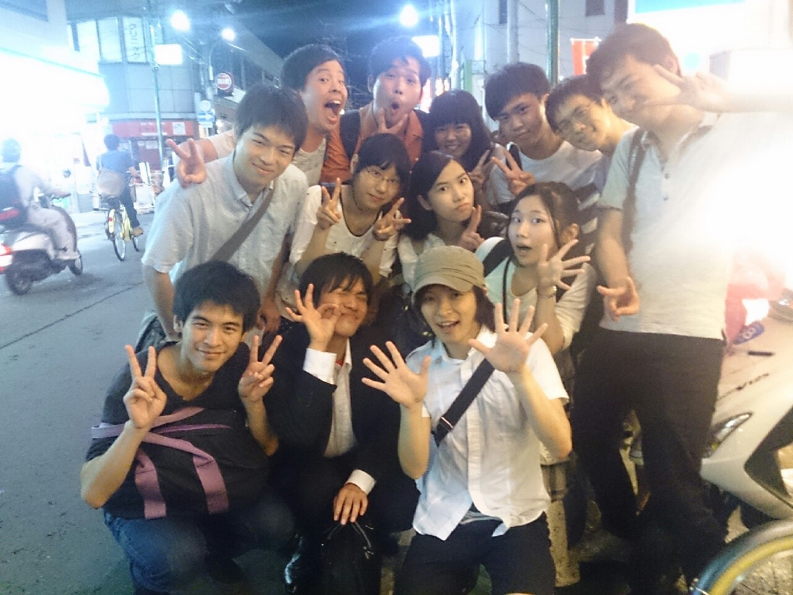
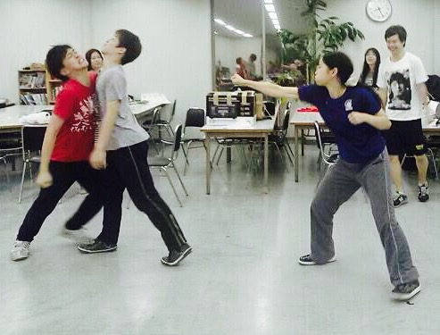

おはようございます！！！

今日もいい天気ですね。

台風がくるそうですが、僕は強風が大好きです！

あっ、四回生のキャサリンです。

今日はあの９期生の、田渕さんが稽古場に来てくださったのです！！

一緒にセブンボーズもさせていただきましたよ！！

今日の稽古場はただならぬ興奮とピリッと緊張感が織り交ざった非常に良い雰囲気での稽古となりました！

アドバイスやお話をいただいて、一同向上心で胸いっぱいになっていました！

いや、まさか稽古終わりにご飯までご一緒させていただけるとは…！

自己紹介もさせていただきましたが、

覚えにくい芸名ばっかりである風習が少しだけ恥ずかしくなりましたね笑

お写真まで一緒に撮らせていただき、演出の茶髪くんは喜びの余り、血の涙を流しています！

また是非お会い出来る機会を心待ちにしています！田渕さん、本当にありがとうございました！

今日の稽古では個人的にドクトル君とたくさんレッスンして、すぐに上達してくれたことに、嬉しさと期待を感じました！

まだまだ一回生たちにたくさんのことを教えてスポンジのように吸収していってもらいたいです。

可能性しか感じないです最近！笑

あと、昨日一昨日と、あの巨体のグルメ君が風邪をひいていました。

台風のせいで皆さんも風邪をひかないように、台風のなかで外に出ないようにしましょうね！

それではまた、どこかで！

最近誠実さについて悩んでるキャサリンでしたーー。

## オープニングだ！！

おはこんばんちは！！

はじめまして、寝ぼすけチーム2回生の如月です！

今日は昨日までの暑さとうって変わって台風ですねー…

風が強いのなんの。

みなさんも物干し竿飛ばされないようにお気をつけください。

さて、

本日の稽古は基礎練のあと、オープニングの段取りを決めました♪

如月はオープニングだいすきです！！

むっちゃテンション上がりますね！！

写真はそんなオープニングの1シーン？

これから始まっていくぞー！って感じがしてワクワクします。

夏！というと、わたしはいろんなことが待ってて楽しい！っていう気持ちと、どこか懐かしいくてちょっと切ないという気持ちになります。

そんなお芝居ができればなーなんて思ったり思わなかったり。

ともかく！

楽しく楽しいものができるように、がんばります！

それではまた！！如月でしたー！
