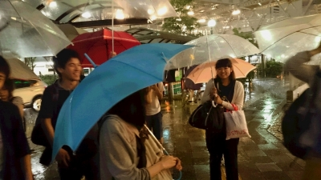

寝ぼすけ初ブログ！ジミーでございます。

台風11号は依然として猛威を振るっており、つい先ほど我らが根城 高槻にも避難勧告が出ました。「電車動かねぇ」なんて声をちらほら聞きますが、皆様如何お過ごしでしょうか?

ジミーは今、振替輸送で阪急電車の中で揺られています。『時をかける少女』見たかった…

私事はさておき、今日は荒通し！………の予定だったのですが、生憎この天気で大事を取り延期に。稽古を少ししてから早めにバスで高槻駅まで降りました。

台風の勢いにも負けない寝ぼすけチーム！！本日はオープニング・アクトの稽古を中心にしました。詳しくは言えないのですが、ジミー的に今回のオープニング。素晴らしいです。今までのオープニングでも三本指には入る？かも。あああーこの感動を伝えたい！けどネタバレになるので言えない！だから本番までお楽しみに！！

以上、なぜか電車の中でおっさんに肩枕をしているジミーでした。今、冒険が進化する！

p.s.　JRってなんであんな遅れるんですかね。阪急を見習え馬鹿野郎
