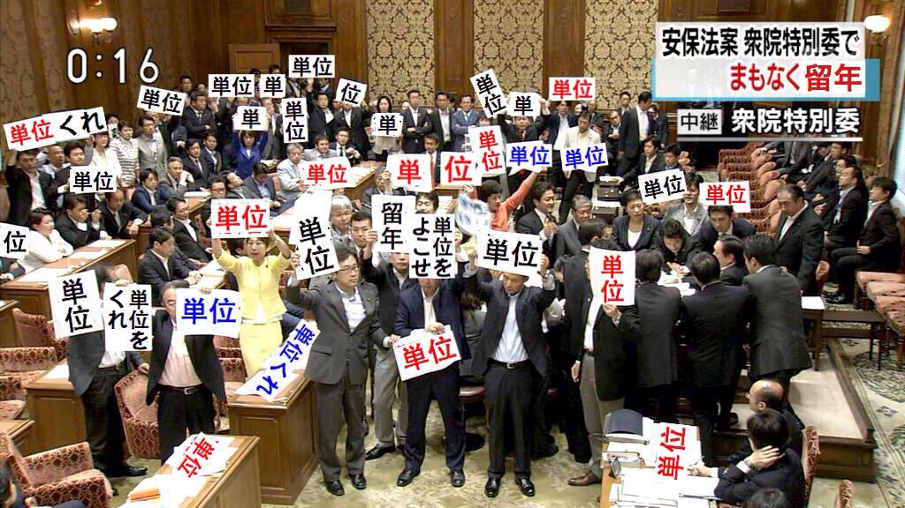

こんばんは。

今回の夏公で、劇団月曜からねぼすけに所属するスナフキンです。

関西大学は試験期間で、昨日今日と休日をどう使うかが大事なところ。でも、ツイッターなんかを見てますと、なんとか祭行ったりなんとかっていうアーティストのライブ行ったり、、おいおい勉強しろ！

それで単位落としたら元も子もないだろ！この世の中には単位がなく、単位に飢えてる子どもたちがたくさんいるんだから。

私たちにできること。彼らにレジメを寄付してあげてください。

以上、ユニセフ日本大使より。
