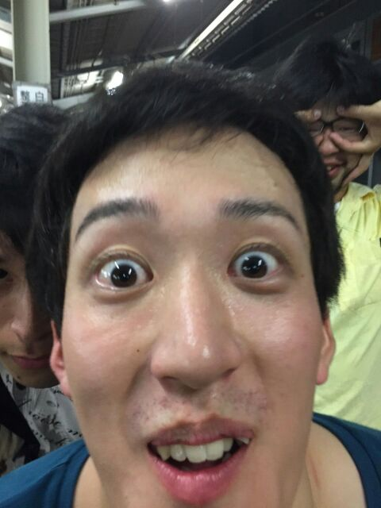

お久しぶりです茶髪です！いやー、8月に入ってきていよいよ稽古も本格化してきましたよ！毎日楽しんでます！

今日は荒通しをしました！本当は7月中に一回は通ししようって言ってたんですけど台風とかいろいろごちゃってしまって、結局今日のが初通しでした。

テスト中間で二週間ぐらいあいてたのにみんなよくセリフ覚えてるなーって感心しました。

こっから段取りも詰めていって、音響の効果が乗っかってきてさらに良いものになっていくんだな～って思ったらワクワクします！楽しみ！

そして今日は学校での稽古が終わった後に全チーム揃って我らがホーム高槻の高槻祭りに行ってきました！騒ぎました。喉カラカラです。一番おいしかったのはイカの姿焼きでした。今年もこれ以降はおそらく夏祭り行けないでしょうからその分エンジョイしてきました！

そしてそして、明日から寝ぼすけチームはキャンプです。3日～5日まで、二泊三日のキャンプに行ってきます！ふ～！これまた楽しみ！水中ゴーグル買わなきゃ

というわけで今日は明日に備えて、早めに就寝する(予定)です。

最近特に暑くなってきてますけどみなさんもクーラーきかせすぎて体調崩すなんてことのないように、お気をつけて！

それではごきげんよう！

PS.今日は稽古場に17期生のゴミさんが来てくれました＼(^o^)／
