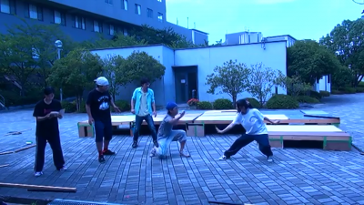
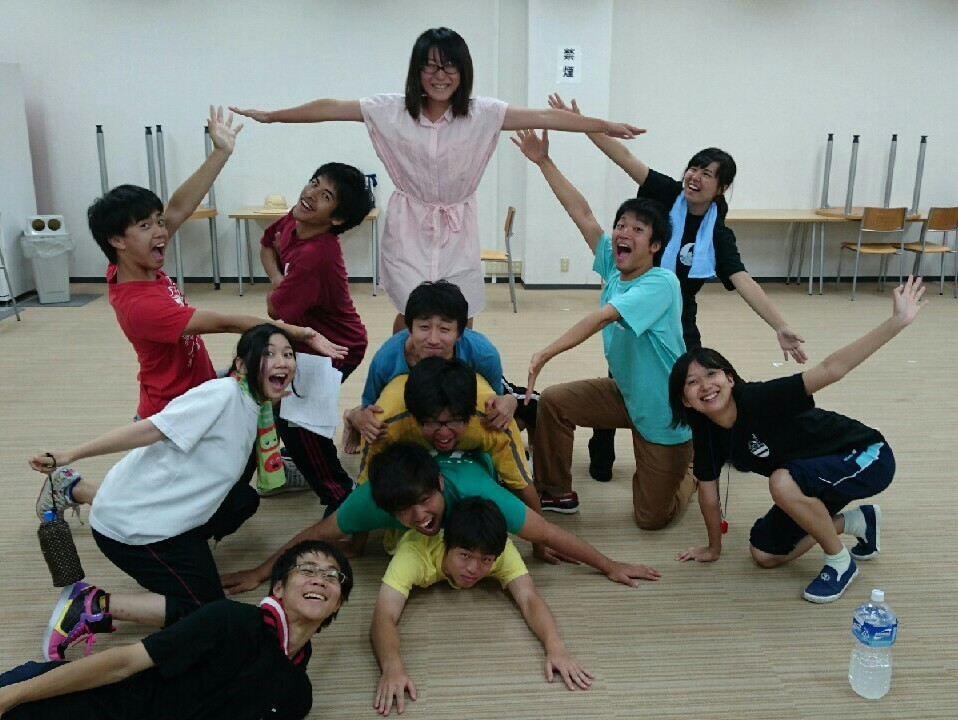

↑遅刻してるのに何食わぬ顔でシーンに参加するジミーの図

こんばんわ！と言っても、もう深夜か。お久しぶりです。ジミーでございます。

　

外部公演から帰ってテスト休みも含めると3週間ぶりの稽古に復帰しました。帰って来た時の…何て言うんでしょうね、実家のような安心感を感じました。

3週間ぶりの稽古って不思議なもので、知らないうちについていた演出に素直に「はぁーかっけー」と感動したり、「こいつ凄い成長してる！！」と驚いたり。すべてが新鮮でした。

1回生も上回生も元気ありまくりなチーム寝ぼすけ。圧倒的パワーと元気でこの暑い夏を乗り切ります。ではではノシ　伊達にあの世は見てねぇぜ！！

　

P.S.本日は18期生のふぶきさんと17期生のシューゾウさんがお越しくださいました。感謝感激

## 何これ！！

こんばんは！今日も暑いですね！！

今回のブログを担当するドクトルです。

本日の基礎連で“何これ”なるものをしました！その名の通り、「何これぇぇぇ！！」な練習でした…って言ってもわかんないですよね(笑)

しっかり説明すると感情やペットボトルを爆発させるスキルを磨くための練習です。

さて、今日も各シーンをガンガン回していきました！周りがどんどん上達していくのを感じて非常に焦りを感じてます( ・\_・;)

ですが、一朝一夕でうまくなるものでもないので横着せずに今は自分の課題を１つずつ乗り越えて行こうと思います！！

因みに写真は“何これ”とは関係ありません(笑)
