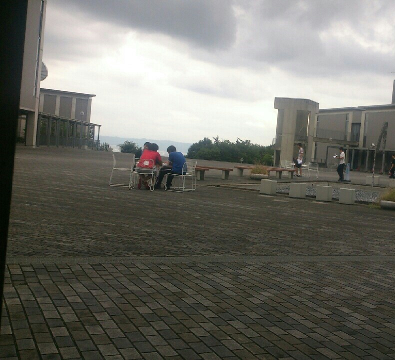

今日のブログは会長がお送りします。

今日は曇りで風もあり、そんなに蒸し暑くない一日でした。

基礎稽古では昨日の「何これ！」に続き二つ新たな稽古を覚えました。

稽古のレパートリーの多さは、新たに知る度に驚きます。

OBの方々にもたくさん来てもらいました。

差し入れありがとうございました、ワッフル美味しかったです！

稽古をしていて先輩方からアドバイスをもらうと、もっと頑張らなければ！、という気持ちと同時に先輩方のありがたさを感じます。

夏も今日で前半戦が終わり、お盆を越えたら後半戦。

もっともっとこのチームから色んなものを吸収して、本番で最高の演技ができるよう頑張ります！

やはり先輩の背中は頼もしいと感じる会長より、今日のブログでした。

P.S. 写真は各々劇について考える先輩方です。
