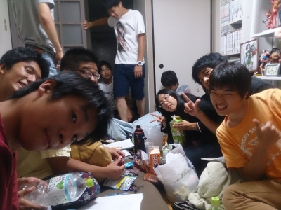
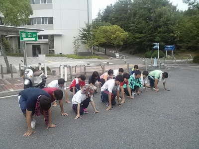

お疲れ様です、おはこんにちこんばんは！

醤油ベースの濃厚なスープが美味しい

ラーメン屋・麺閣で幸せを噛みしめながら

バトンを引き継ぎました、ベルです！

要領のいい人になるためにも、

早速過ぎますが活動報告していきますっ！

今日は ミ ー テ ィ ン グ でした。

（響きが"くぅる"で"とれんぶる"。）

キャサリン先輩邸で行われたのですが、

毎度集まり具合が素晴らしい寝ぼすけは

お部屋を人、人、人で埋め尽くしました！

チーム結成直後に行われたブレストでは

語られなかった、シーン１つ１つの役割、

登場人物の心情、台詞の意味、他諸々を、

1 / 4 日 以上の時間を費やして

これまたアツく意見交換しました！

浮かんだ疑問は惜しみ無く発信し、

それを芸術作品と思わせるほどに

見事に解消させていき、

しかしその合間合間に笑いを忘れない。

そんな先輩方の姿、輝かしかったです！

頭がカタい私は、話に食らいつきながら

ほんの時々ふわっとした意見を

出すことしかできませんでした…。

もっと本を読んで精進せねば。

今日を含め、改めて行われた話し合い

（少人数で集まる日も何度かありました）

を通しての感想。

稽古は後半戦に入り、キレイだった台本も

黒鉛で結構見苦しくなってきました。

毎日目を通すので結構読み込めてるのでは

と慢心してしまう日さえありました。

しかしそれは全くの気のせいで、

まだまだ分析出来ていないと気付き、

演じる側が考察べき情報について

学ぶことができました。

自分の力で３Ｄにしたつもりの台本は

実はハリボテで、でも皆様の力を借りて

今度こそリアルな３Ｄに修正した感覚！

…やはり不思議な気持ちです。

明日（実は今日）の稽古以降、

各々の演技はどのように変わりはるのか！

ドキドキしながら文字をうってます。

因みに、ラーメン屋で

あ の 会長と交わした話題の１つに

「俺達成長できてるかな問題」

が挙がりました。

確かに、

自身を完全に客観的に見るのは難しく、

こうだという確信はもてません。

でも、確かな事があります。それは、

この夏を他でもない 寝 ぼ す け チーム

として過ごし、その中で本当に沢山の事を

教えて頂いていること。

そして私たちがすべきは、

成長しているか否かは最早考えず、

それらを夏公で全力で発揮させる事！

は勿論、これからの公演でも活かし続け、

皆、いずれは後輩とシェアしていく事！

ドヤ！

…はい、言うのは簡単承知の上、

若者バカ者足掻いていきます！(笑)

暑かったり涼しかったりな日が続きますが

水分はペットボトルに入れ（意味深）、

こまめな水分補給を忘れず（意味深）、

心はゴリラに戻った気分で（意味深）、

この夏を制覇していきましょう！

以上、

クラッシュ脱水ゴリラのベルでした！

## この時期に~...えっ！？

こんにちはー！

稽古終わりすぐのマキが今回お送りしまーす！！

今日はパンフ撮影の日でした＼(^^)／

みんなは衣装を着てそれぞれ十人十色なポーズをしてました！...みんな個性でてるなぁ...個性がほしい！！(/´△\`＼)

そして今日一番！って言えるくらいに印象深いのが、マラソンです！この時期に！？って思うかもしれませんが...マラソンをしたんです！

大学からさらに上に登った神社まで走りました。

上り坂が苦しくヒイヒイ言っていましたが思っていたより距離が遠くなく、無事につくことに成功！

ついてからみんなでそこの神社で今回の公演の成功を祈ってから帰るためにまた走って帰りました(^^)/

天候がまだ走りやすい環境なのがホントによかった(\*´ω｀\*)

自分を含めてみんなお疲れ様です(・ω・｀=)ゞ

疲れた体を無理矢理動かし、より良い公演のために練習する我らがねぼすけ達！

まだまだアイディア出ます！反復します！熱意あります！

ねぼすけ達は公演の日に向けてのパワーがすごいです！...負けてられませんね(\*￣∇￣)ノ

そんな僕たちの公演楽しみにしていてください！

写真は稽古前とマラソン前のものです！前繋がりだね！(^-^)v

最後につまらないこと言いました・・・(；´Д｀)

以上マキからでした！

そいやっさぁぁ！！
