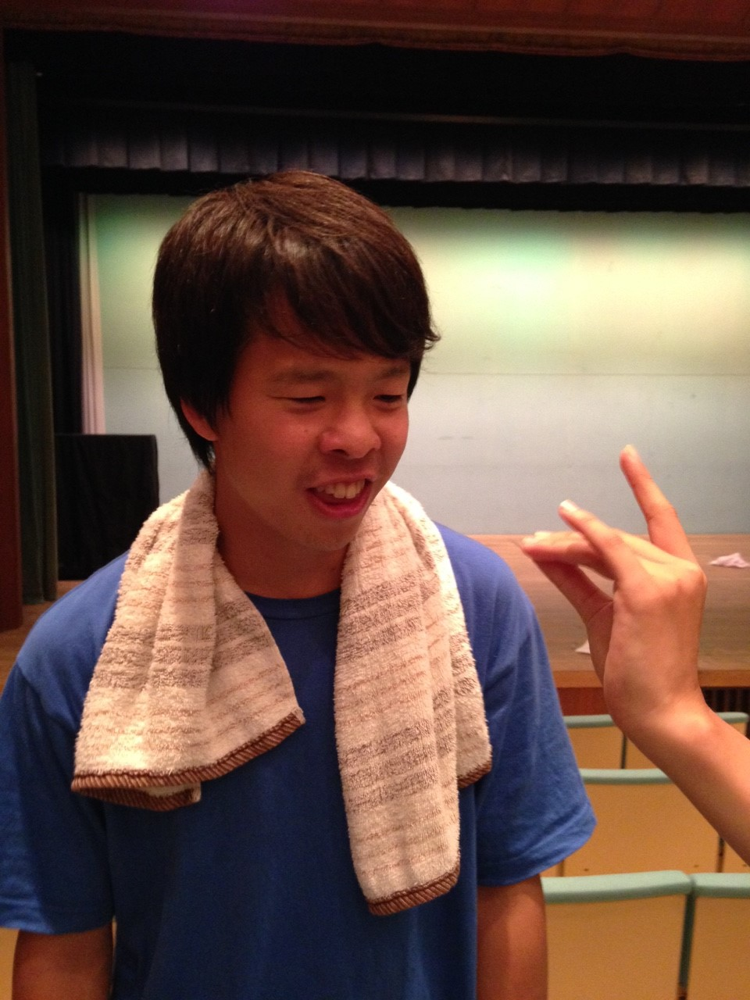
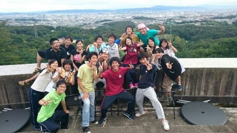

どうも、最近虫刺されが治ってきてうれしい散葉です。

夏の終わりも近づいてきて、最近は涼しくて過ごしやすい日が増えてきてますね。

そして、それと一緒に近づいているのが、夏公本番です！！

稽古も残すところあと一日、緊張するような寂しいような気分に襲われますが、

寝ぼすけは最後まで走り抜けて行きますよっ！

写真は、私の同期で一番すぐに人間をやめちゃうキャサリンです。

## 夏休み

こんばんは！

本日のブログは一回生のジャンヌがお届けします。

今日は小屋入り前最後の稽古でした！

基礎練をしたあと、午後から学校で舞台を組んでの通しをしました。

あっという間に終わってしまった感覚です。

そしてそして、OBのたろうさん、聖さんが来てくださりました。

素敵なアドバイス、有難うございました！！

月曜から寝ぼすけチームが始動してから早いものでもう2ヶ月が経ちました。

チーム発表時のドキドキ、今でも鮮明に覚えています。

演出さんに名前を呼ばれて、同じチームの先輩方とハイタッチをして。

あの日に撮った、初めての集合写真をみると懐かしく感じてしまいます。

夏公の稽古が始まってから色んなことがありました。

劇づくり以外にも、蛍狩り、球技大会、七夕、お祭り、キャンプなどのイベントや、晴れた暑い日にケイドロやスイカ割り、水浴びをしたり、、、

稽古場にはたくさんのOBOGさんが来てくださり、熱いお言葉をいただきました！

どの方も親身になって相談にのってくださり、とっても嬉しかったです。

本当に楽しい思い出がいっぱいです。

こんなに楽しい夏休みは生まれて初めてです。

こう振り返ってみると、本当に充実した夏休みだなって思います。まだ夏休み真っ最中ですが。

また、こんなちっぽけで未熟者の私に対して、こっちが怖くなったり不安になったりするくらい、優しく時に雑く接してくださる寝ぼすけの皆さんに本当に感謝しています。

優しさに甘えてたくさんご迷惑をおかけしました。

自分の演技に自信があるとはまだ言えませんが、寝ぼすけで過ごした時間、チームの皆さんの存在があると思うと不思議と勇気がわいてきます。大好きです。

そんな夏公も、もう数日で終わってしまうと思うとさみしいです。

だけど、この先にもっともっと楽しいこと、知らないことがあると思うと前に進みたいなって気持ちになります。

いろいろ書き出すと止まらなくなってきました。笑

明日は仕込み、ゲネです！

朝が早いので寝ぼすけといえども寝坊しないよう、目覚まし時計に願いを込めて寝ようと思います。

楽しく！悔いの残らないよう！最後まで全力で！駆け抜けていきます！！！！

一人でも多くの方に観ていただきたい作品になっています！

ご来場、心よりお待ちしております！
