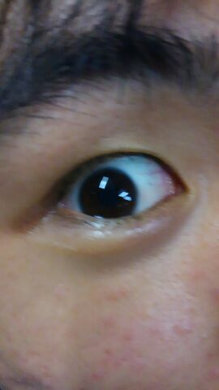

こんばんは。

ブログでのご挨拶が遅れて申し訳ございません。

改めまして、夏公演の演出させて頂くもーりんです！

もうついに4回生ということで色んな意味で震えが止まりません。時の流れは残酷ですね…

これから色々と大変なことや忙しいこと、頑張ることが多くなってきますが何よりも

「楽しむ」

ということを大事にしていきたいなあと思います\*¥(^o^)/\*

また今後Twitterやブログの更新で私たちのチームだけではなくちゃぱつチーム、うみちゃんチーム含めて万の夏公の様子を見守って頂ければ幸いです。

これから約2ヶ月どうぞよろしくお願い致します！

もーりん( ´ ▽ \` )

## ぴちぴちぴっち

みなさんこんばんは！！！

４回生のアイル(せな)です。

とうとう夏公が始動しはじめました＼(^o^)／わーい！

１回生から４回生までみんなどきどきわくわくで頑張っております！！

今日は演出のもーりんが不在だったので、みんなで台本を読む練習をしてました！

いやーやっぱり稽古はたのしいですねー＼(^o^)／

特に今まで共演したことのない人たちとの稽古は新鮮でフレッシュでピチピチですね！！若返ります！

そんな感じで今年も頑張っていきたいと思います！！！

それでは車酔いでグロッキーなアイル(せな)でした。

写真は期待の１回生！インテグラルくんです！キラキラしてます！
