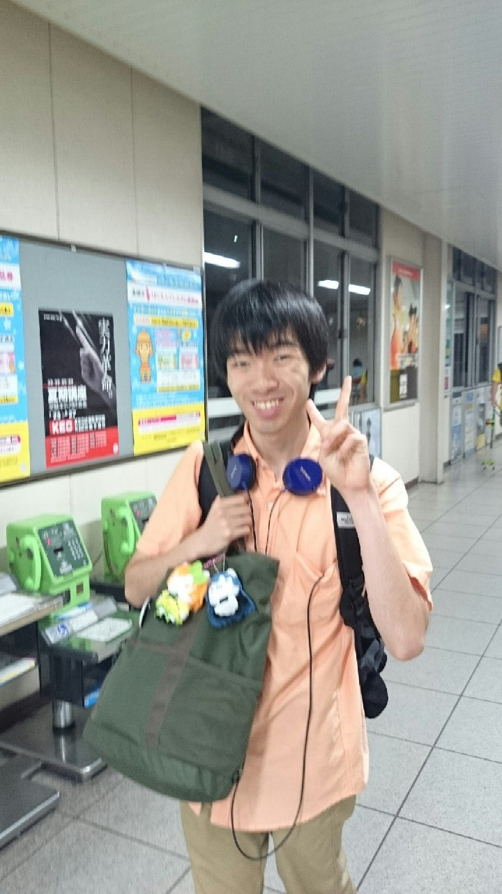

皆さんこんにちは！劇団「海をかける少女」略して「海かけ」の1回生

ヘッドホンとラブライブ！なカバンがトレードマークの銀です！初投稿です！

TC祭では前座の音響のお仕事だけやっていましたが…

なんと！この夏公演では音響に加えて役者に初挑戦します！

役者として初めて渡された本格的な台本を見た時はビックリしました 笑

役者をするのも初めて、長い劇をするのも初めて…とにかく自分にとってたくさんの「初めて」を経験することになりそうです^\_^

それでは今日の活動報告をします！

今日の海かけは富田の公民館で稽古をしました。基礎練でいつもより少し多めのエチュードをやった後は22時まで夏公の練習をしました。

自分はまだ右も左も分からない役者なので先輩のやる演技はどれも参考になるものばかり…

だからこれからも先輩の演技を参考にしてちょっとずつ成長していこうと思います！

以上！「この夏は海かけのみんなとの絆を深めたい！」銀でしたー！

……残る海かけ1回生はあと3人！乞うご期待！
