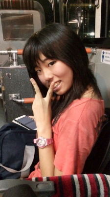

皆さん初めまして。ピンクの定期を首から下げた万絵巻一回生のピカチュウと申します。TC祭では役者(と名ばかりの)小道具をさせていただきました。街を歩く時、どこからともなく鈴の音が聞こえてきたらもしかしたら私かもしれません……

演劇は中学時代にかじった程度でしたが大学でサークルを探していた際偶然ここに巡り会い、皆さんの演技に心を打たれて演劇への思いが再熱したのがきっかけです。久しぶりに本格的な台本をいただくことができて当時を懐古すると共に、以前より高みを目指してやろうと気分が高まっております。

閑話休題、本日の活動報告です。基礎練では体育大会で皆さん筋肉痛であるにも関わらず、アメンボスクワットやアメンボダッシュなど体力的に厳しいものばかりでした(笑) 今日のエチュードは1グループ8人いるにも関わらず4分半で強制的に落とさなければならないスタイル(名前忘れました……すみません)。エチュードがいつになっても慣れない私にとってはなんとも鬼門でしたが、終わってしまえば意外に楽しいもの。この調子で少しずつ演技の幅を広げていきたいものです。

稽古ではまだ自分の事で一生懸命ではありますが、ようやく先輩方や他の同回生を観察する余裕が少しできてきました。まだまだ皆さんからは学ばなければいけないことばかりで、毎日がとても充実しています。

語り出すと長くなるのが悪い癖ですね、ここまで長々とお付き合いいただきありがとうございました。

それでは、次回も格好良く決めたいよね( ▼˓◞ ⁼̴̶̤́ )✧
