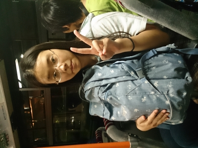

はじめまして、万絵巻一回生の小町と申します！遅れてすいません(>\_<)海かけの一回生は私で最後ですね。写真は私ですが疲れきった顔してますね(笑)

TC祭では衣装と少し役者をさせていただきました。本格的な演劇は大学に入って初めての経験ですが、昔から舞台に立つのは好きなので、楽しく充実した日々を過ごさせていただいてます。

昨日は基礎練と空間補充からのポートレート、本日は富田公民館で基礎練とディベート、ウィンクキラー、エチュードをしてから夏公の練習をしました。ディベートは意見がうまく出せませんでした…。発想力が足りてませんね。がんばらないと…。

夏公では先輩方や同級生にも相談しながら良い物を作りたいと思います！

以上、小町でした！！
