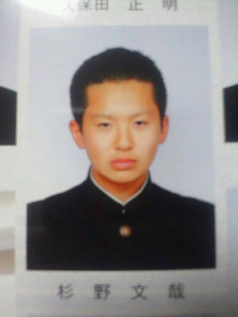

こんにちは、うみかけチーム二回生「スギちゃん」です！役職は音響と映像制作をやらさせていただいてます。まだ映像制作の活動は始まってませんが、次回公演のPVやメンバー紹介映像などを制作し、広報活動の一環として万絵巻を支えていきます！

ボランティアみたいかもしれませんが、発声練習にもたま～に顔を出したり、エチュードやったりします(^^;

好きな料理はカレーライスで、得意料理はオムレツです！あっ、僕下宿組なんですよ～( ＾∀＾)実家は岐阜県の養老町というなにも無いところです。うふふ～

では、詳しい自己紹介はまた今度で！

昨日のうみかけチームは炎天下の中、稽古を…、と聞いていたのですが、僕が行ったときにはエアコンが効いたS棟で稽古をしていました。僕はまだ音響の仕事はありませんが、稽古の様子を見てインスピレーションを高めてました！何もしてなくないです！

稽古の後は、箱庭計画さんによる茶髪さん主演の「うたかたラプソディー」をチームで観に行きました。スナフキンさん以外の万メンバーの役者ぶりは初めて拝見しました。皆さん、S棟の中では変人なのに、舞台の上になるとすごくイメージが変わって見えました。茶髪さん、ラムさん、スナフキンさん、たけくまさん、お疲れ様です。

以上です(\*´ω｀\*)
