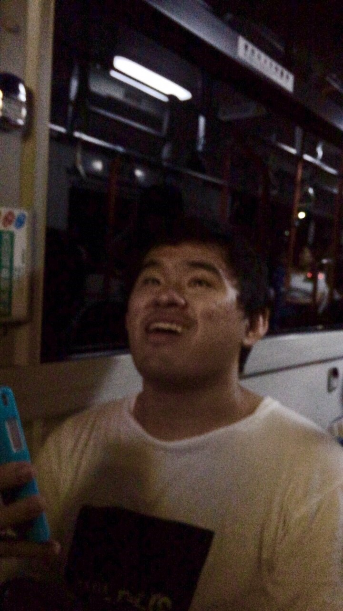

どうも、おはこんにちばんは。

夏ですね。最近は晴れが続きますねー汗が止まりません…暑さにとても弱いみたいです…まぁそんなことはさておき、そろそろテストですね～今はレポートに追われています。逃げ出したいです。

閑話休題。

稽古が始まり、はや3週間弱、大半のセリフ覚え出ハケや段取りも決まりつつあり早くも本番が待ち遠しくなっております。

まだ気が早いですね´д\`

学校があるのも残り2週間！テストが終れば夏休みが始まります&#8252;&#65038;

稽古三昧の日々がスタートですね！

ほかにはキャンプありますね！一回生とさらに仲良く慣れればいいですね～

キャンプも稽古も本番も全力で楽しもうと意気込んでいるホロからでした～

写真はレポートに追われ絶望のラムさんです。
