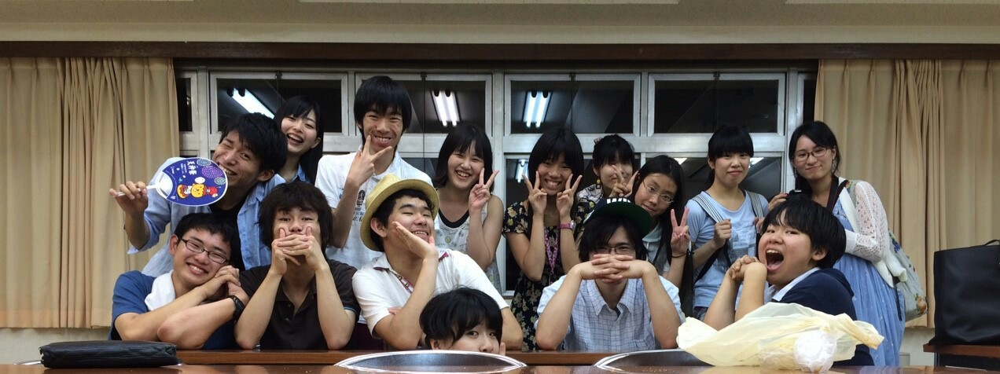

今日は荒通しでした！

初めての、立ちで出捌け等の段取りをつけた通し。

皆、各々の課題が見えたようで、終わったあとは通し前と違う顔をしていました。

こんなに真剣に頑張れる皆なら、きっと大丈夫。

皆の真摯な態度を受け、早くも期待を膨らませて貰ってます。

でも、まだまだですね！！！

ダメダメです、自分含めて！

今日までを反省して、明日からまた積み上げていこうと思います。

まずは通し映像を観る所から！

本番には、必ずや最高のものを(\*´ー｀\*)

最近、チームの皆のこれまでと違った表情がたくさんみれて嬉しいです。

四回生は、皆に対してテキパキ的確にアドバイスをして下さいます。いつのまにか、最高学年という言葉が板についていて、余裕のある姿にいつも助けて貰っています。

三回生は、自分が期待されている事が分かり、欲しい所で絶対に手を貸してくれる。これは同期故の印象かもしれません。でも、少し前より格段に、優しいです。

二回生は万に染まりきり浸り、どんどん自分を出してくれます。そして初めての先輩姿。もともととても期待していたのですが、その300倍くらい先輩してくれてます。

一回生は、以前は常に能面のような表情でミステリアス極まりなかったのですが、チームが仲良くなるにつれ、どんどん表情が動くようになり、口数も増え、最近は私に「こういう風にしたいんですけど」と演技の相談に来てくれるようになりました。加えてノリノリでブログ書いてくれます。萌えー。

このメンバーいいなぁ

スタッフも役者も、全員が成長してる姿を見て、良いもの見れてる！お得感感じてます(\*´▽｀\*)

って語りすぎですね。もう夏終盤かよって感じ。まだまだ折り返しでもないですよ！

明日から台本が外れるので、私も気持ち改めより濃いシーン回しをしていく所存です。

OBOGさん、是非とも稽古場に遊びに来てくださいね。

いつでもウェルカムです！

そして8/29は是非本番を観にいらして下さい！

海かけ演出のうみでした(\*´ー｀\*)
