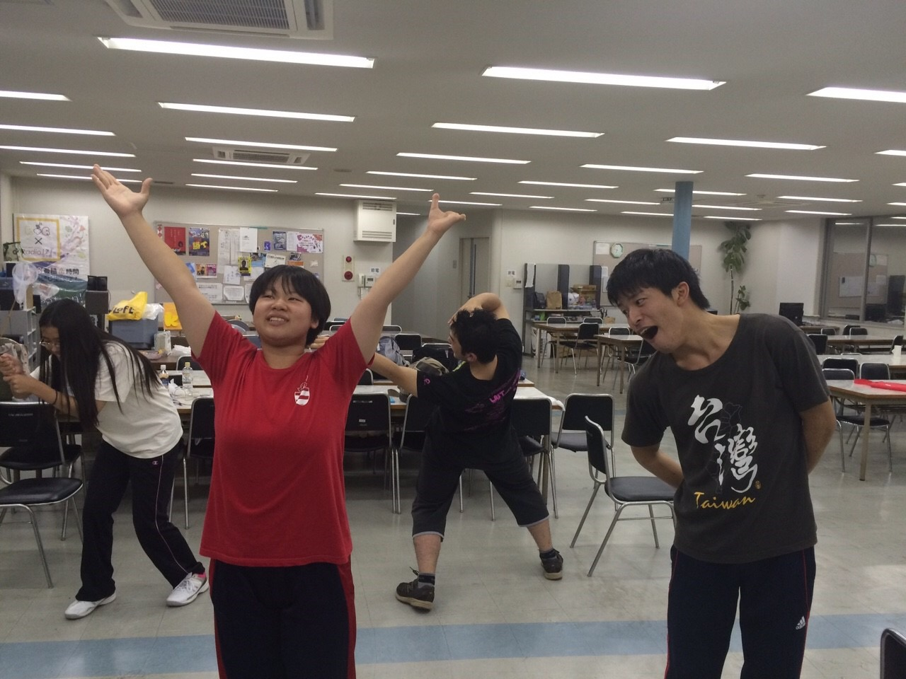

どうも、二回生のりんです

荒通しが終わり、台本をはずしての稽古が始まって2日が経ちました。

私含めみんなまだまだ自信のないところがたくさんあって練習あるのみ！という感じです(｀・ω・´)

あと、昨日は稽古でポートレートをしました。写真はその一部ですね

お題は「台風」なんです。わあ！

なんてとってもタイムリー！！(›´ω\`‹ )

ちなみに台風は大和で、その隣にいるともしさんは台風に巻き込まれそうになっている低気圧だそうです。

一夜明けてもまだ復旧していないところもあるんだとか…

みなさま安全第一で気をつけてくださいね( ´ ；ω； \` )

