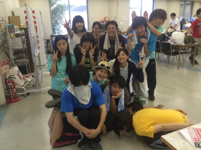

どうも、ホロです。マイクラできてません。そんなことはさておきですね…

今回の稽古には14期生のnoriさんととんなさん、18期生のふぶきさんが稽古に来てくれました&#8252;&#65038;

お忙しい中ありがとうございますー( ´ ▽ \` )

稽古に関して！

エチュードでは爆笑しました。

今日の名(迷？)言はアルゴさんの「この鳩で鳩サブレ作ってやるぜ！」です！

僕的には「頭から食ってやったぜ！」も好きでしたね！

タケノコの罰ゲーム的なエチュードはなんかすごいなって思いました。とても楽しそうでしたー

シーン回してて出来て来てるなーとか、思ったりまだできると思うなーとか、下回生にはこの夏で沢山のことを学んで欲しいですねー

ここからは個人の感想

今日はゲリラ豪雨的な狐の嫁入り的な豪雨に降られました。これで突然の豪雨に降られたのは3回目です…解せないのが最初は普通に降ってて突然の豪雨に変わるとこですね。盛り上がりに関してはライブかよ。てな感じです。今日に至っては、傘がお亡くなりになりました…南無三

長いのでおしまい。

それではサヨナラぐっばい&#8252;&#65038;

p.s 明日は通し&#8252;&#65038;

## 炎天下の通し ～みんなとボクと、時々、OBさん～

どうも！2回生の大和です！

本日はタイトル通り、炎天下の中、通しをしました！

昨日来てくださったOBのふぶきさんがなんと今日も来てくださって、ダメ出しもしてくださいました(＊´∀｀)ありがとうございます！

そして今日は、ちゃんと舞台を建て込んで、その中で基礎練もしたりして、通しを開始しました！

しかしこの暑さ…どうにかなりませんかね…？( ；´～｀)

自分が出ないシーンは日陰で待機したり、適宜水分補給をしたりなど、みんなで暑さに負けないよう通しを進めました！

通しが終わった瞬間から、映像を見るまでも無く、通してみてわかる課題とかがいっぱい見えて、これからもっともっと気を引き締めないとなぁと実感しました。

映像を見て、さらに細かく自分の課題を探そうと思います！

今日は無事にバラシまで終え、解散することができましたが、このブログを読む皆さんも十分熱中症にはお気をつけください…！

建て込み指示で散々あたふたして頭いっぱいいっぱいだった大和でした←

精進します←
