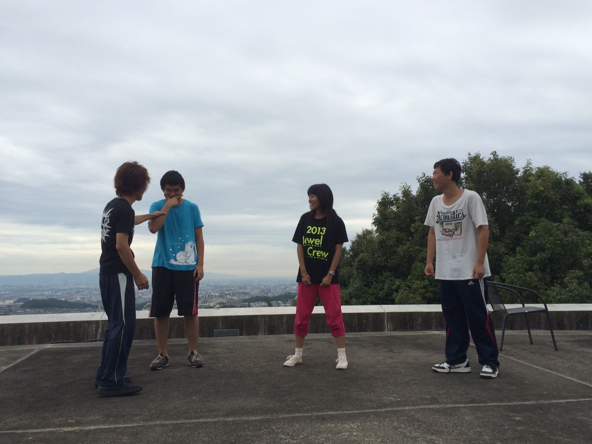

どうも！スギちゃんだよ！ウェイ！

昨日まで実家の岐阜のほうへ帰らせていただきました。話変わるけど、岐阜にある関ヶ原という場所を境にどん兵衛の味が変わるんですよ～。こっちは昆布ダシ、あっちはカツオダシ。どっちも美味しいよ( ＾∀＾)

夏公が迫ってきました！各チームラストスパートですね！僕は役者ではありませんが、一回生役者組の緊張の糸がほぐれて以前より稽古場の雰囲気、表情が良くなった気がします！

明日は通しです！お仕事がんばります！暑いので水分補給はこまめに！

では！うみかけ～ノシ

(僕も役者やりたい)

## 本番まで残り10日！！

お久し振りです！最近大声と奇声をあげることが快感になってきたパズーです。

チーム発表からもう2ヶ月も経ち本番まで両手の指で数えられる日数になりました。ですが、うみかけはまだまだ良くなっていくというか今のまま満足してはいけないので改良に改良を重ねより良い劇を作る所存でございます。

この辺で今日の活動報告です。

本日は３度目である通しを行いました。今回は本格的にBGMとSEが入って役者も場面の雰囲気が分りやすくなりテンションも上がってたとおもいます。(≧▽≦)

やっぱり音が入ると気も引き締まりますね(\`へ´\*)

自分はつい先日漸く声の出し方が分かるようになってきて前回は見るのが嫌だった通し映像も今回はどれだけ変わったんだろうという期待で早く見たくて見たくてしょうがないです。

写真は階級エチュードでお題「お母さんと一緒」です。ラムさんの困ったときの銃をじじさんが笛にするという殺人の起こらなかった珍しいパターンです。(\*´∇｀\*)

自分は一番下の番号を引いたんですけど同回の小町曰くくじ引いた瞬間に顔に出てたらしくポーカーフェイスがなってないと指摘されました(ToT)

さあ、残りの練習は本番に悔いを残さないように感情を爆発させてかけぬけよう♪ヽ(´▽｀)/

PS.負け抜けセブンポーズ最後まで残りたいな(ノ\_・,)
