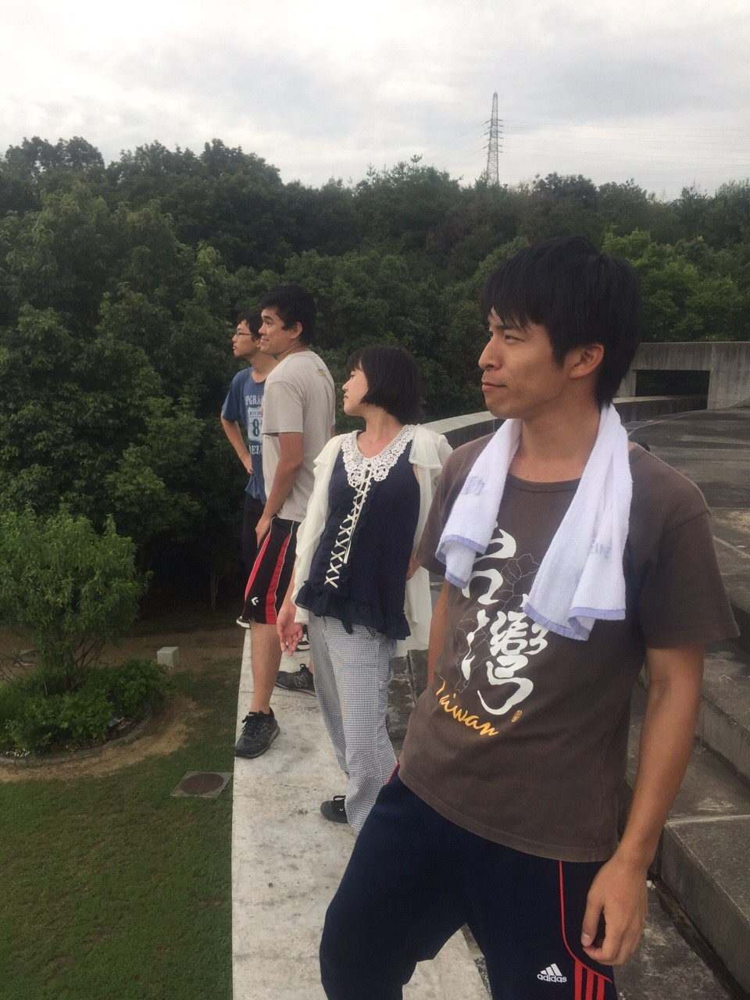

皆さんにゃんぱす～…じゃなくておはよう、こんにちは、こんばんは。今年のお盆休みは家で台本読んでたor艦これorとうらぶorツムツムorポケモンorスクフェスやっていたという自宅警備な日々を送っていた銀です。ところで皆さんは今期のアニメは何を見ているのでしょうか？やっぱり「がっこうぐらし！」でしょうか？ちなみに僕は「Charlotte(シャーロット)」「のんのんびより りぴーと」「アイドルマスターシンデレラガールズ」etc…を毎週楽しみにしながら見ています！

どうでもいい話を長々としてしまいましたね 笑

本題の活動報告をします。

今日は学校で午前中基礎練をし、午後からテラスで夏公演のシーン回しをしました。自分はよく「感情や表情を出して」「目線を合わせて」「自信持ってセリフ言って」ということをダメ出しされるのですがどのダメ出しも全部自分自身の悪い点(今まで無感情で生きてきた、人の目を見て話さない時がある、自信を持てない時がある)ばかりなので役としてのダメ出しというより今まで生きてきた自分に対してのダメ出しに思えることが時々あります。しかしこれは自分の悪い点を大きく改善できる絶好の機会でもあるので稽古の残り日数は少ないですが精一杯頑張ろうと思います！

それと今日はOBのたろうさんが来て下さいました！ありがとうございました！

稽古日数も海かけのみんなと絆を深める楽しい夏も残りわずか！一日一日を無駄にせずに頑張っていきまっしょいっ！

写真はテラスからの絶景を眺める海かけメンバー4人(奥からパズー、らむさん、うみさん、ともしさん)です！
