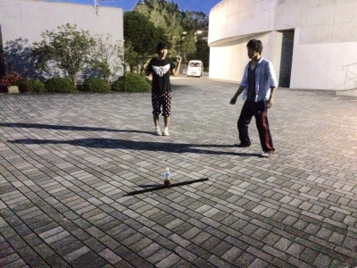
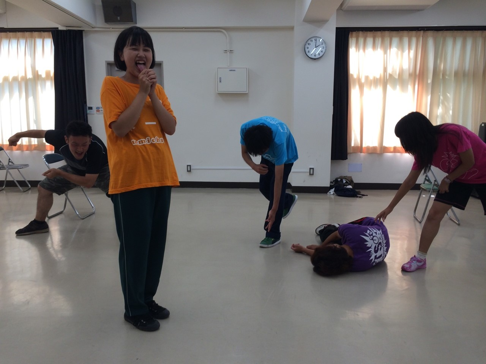

こんばんは、ピンクの定期を首から下げた万絵巻一回生のピカチュウです。最近定期入れにコレクションカード類を入れすぎてついにバスでタッチが反応しなくなりました。皆格好いいんですもの。

今日はオープンキャンパスがあったようで、約一ヶ月ぶりに活気付いた校舎を横目に去年の私もあんな感じだったのかとしみじみ。時間の流れは早いものですね。

本日は仕込み説明会がありました。いよいよ本番が近づいているという実感がじわじわ湧いてきて楽しみ半分不安半分……(笑)

説明会が終わった後はもーりんさんチームと合同で基礎練を。前回ブログを担当させていただいた時は「エチュードがいつになっても慣れない～」なんて書いていましたが、最近ようやく苦手意識がなくなり少しずつですが楽しめるようになってきました。とはいえ改善点はたくさんあります。相手の話題に乗るだけでなく先輩方のようにお題に沿った土台をしっかり作れるようになりたいです……

まだまだ至らぬところはありますが、絶対素敵な劇にしてみせます！ 楽しみにしておいてください♡

本日はOGの琴音さん、OBの栃木さん、ジュークさんが稽古を見に来てくださいました。 暑い中わざわざありがとうございました。

写真は自主練中の様子です。皆さん輝いていますね。

以上、長々と失礼しました。

それでは、次回も格好良く決めたいよね( ▼˓◞ ⁼̴̶̤́ )✧

## no title

こんばんは、小町です。地蔵盆である本日も公民館の方で稽古をしておりました。OBのひじりさん、課長さん、OGのきほさん、今日は来ていただき、ありがとうございました！！

さて、本番がどんどん近くなっておりますが、まだまだ自分でも満足な演技ができていません。それでも、後悔だけは残さないように日々を過ごしたいと思います。

最近は基礎練を楽しいと感じられるようになりました。先輩方の発想にはいつも驚かされ、笑わされております。今日の写真はその基礎練の一部のポートレートです！

まだまだ暑い日が続いておりますが、体調管理にお気をつけください。
