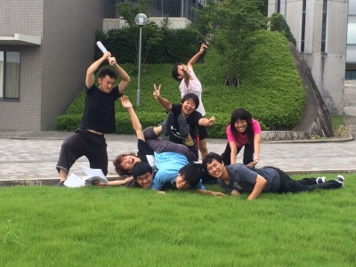
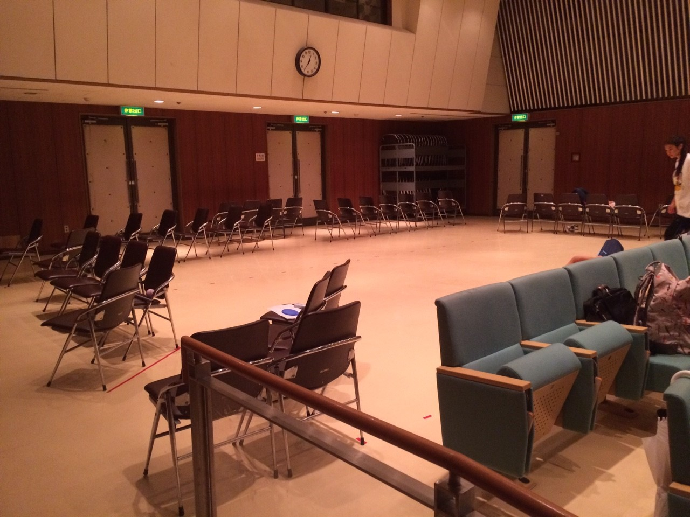

## うみをかける

こんばんは、

三回生のじじです！

今日は風がすんごかったです。

とっても涼しかった！

いや、涼し過ぎた…！

いや？寒かった…。

明日はラスト稽古です。

え？マジか&#8265;&#65038;

今まで色々あったなー、

やっぱり夏って楽しいですね！

こんな青空で、こんな日焼けして、あんだけ大声出して、

それでもまだ足りないなー（笑）

明日はラスト。

Time waits for no one.です（笑）

一回生たちはがむしゃらに頑張ってます！えらい！

本番まであと少し！

私たちは全力でかけていきます！

## 稽古最終日

演出のうみです。

今日は衣装着てテンション上がってるみんなの写真ばかりだったので、ネタバレ防止のためにあえて誰も写っていない写真を選びました。

通しをした、実寸サイズの舞台です。

パネルを想定した椅子が連なっています。大道具さんほかありがとう。

本日は12時間稽古。そしてドレリハがありました。

もう明確なダメ出しは数えられるほど。

私の仕事に終わりが見えてきています。

ところで、「稽古最終の３日で役者は変わる」という話は本当だったんですね。

こんなにその言葉を実感した公演は無かったです。

稽古ラスト３日の日に通しがあったんですけど、

今日はその時のダメ出しだったり、これまで耳タコだろうほど言ってきた総論的なダメ出しがほぼ潰れていて、嬉しかったです。

チームの全員がより良い作品を作ろうと精進してくれているお陰です。

さてさて、私一人は絶対に到達し得ない、海かけの一人一人の全力の思いが詰まり出来上がる一つの作品。

それは一体どういうものなんでしょうか。

まだ海かけの作品は完成していません。

今日の通しは、満足な舞台がない！やらないやらない詐欺しといて結局やった舞台美術がない！照明もない！お客様もいらっしゃらない！そのお客様に広報物も見ていただいていない！！お客様がいらっしゃらない！！！！！

29日の本番に、完成した作品をお見せできるように、稽古日程は終わりましたがまだまだ精進していきます。

全員まだまだできるで！！！！！ほんまやでーーーーー！！！

明日から仕込み、頑張るぞー！
