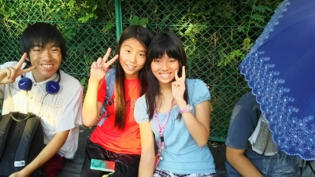

こんにちは。3度目のブログ当番になりました銀です。

早速ですが今日の活動報告をします。

今日は朝から高岳館で仕込みをしました。そして午後から短い時間ではありましたが海かけのチームは基礎練&シーン回しをしました。

小屋入りを果たし「明後日の自分はこの舞台でどんな演技をしているのだろう」と期待と不安を抱えながらも「あぁ…海かけの夏ももうすぐ終わってしまうんだな…」と少し寂しい気持ちにもなりました。

僕がブログ投稿するのは多分これで最後だと思うので今言いたいことを全部言います！

僕はこの海かけに入って本当に良かったぁー！役者に初挑戦したおかげで「新しい自分」を見つけ出せたと思います！引っ込みがちな自分を大きく変えてくれた海かけのみんなが大好きです！そんな思いを抱いて演じる本番まであと2日！最後まで全力で駆け抜けるニャー！（≧∇≦）

写真はこの夏最高のキズナを深めた1回生4人です！(日傘の中にパズーがいます 笑)
