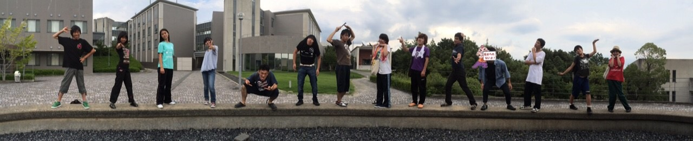

皆さんこんばんわ。ピンクの定期がトレードマークのぴかちゅうです。正直今日書くと思っていなかったので何も考えていません。ありのままのぴかちゅうです。

あっという間に本番前日。期待と不安が入り混じる最終夜を過ごしています。

今日は仕込み2日目でした。 うみかけは場当たりとゲネを高岳館で行った後コミュニティールームに登って最後の稽古を数時間。自分が覚悟していたよりは大教室は狭くて。今までに立ったどのステージよりも客席との距離がとても近いにも関わらずそれでも後ろの方まで声が届かないだろうと言われ本当のところ割と緊張しています。

……でも、このチームで絶対に素敵な作品に仕上げる自信があります。そう言えるだけの稽古をしてました。

皆さんとこの暑い、熱い夏を過ごすことができて本当に幸せです。写真は一部のメンバーが欠けているもののこの夏を共に生きた大切な人達です。

最後の1日まで全力で駆け抜けますのでどうか見守っていてください。

それでは、本番も格好良く決めたいよね( ▼˓◞ ⁼̴̶̤́ )✧
