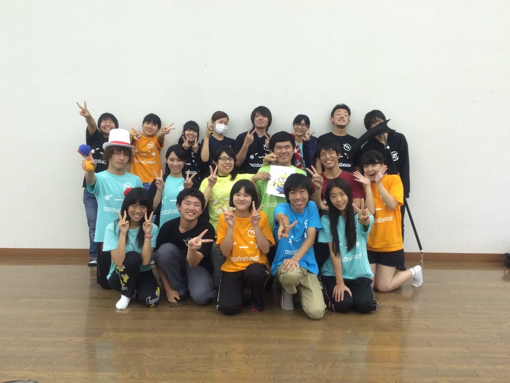

劇団万絵巻第19回自主研究発表公演が終了しました。

観に来て頂いたお客様、誠にありがとうございました。

劇団海をかける少女は、この２ヶ月半の間、物語の主人公の成長が軸となるお話に取り組みました。

不器用な少年が、苦悩の原因となるものを一つずつ解決していって、最終的には全てを振り切って、ハッピーエンドではないにせよグッドエンドを迎える物語です。

現実はそんなに上手くいかねーよ！人生なめてんじゃねーぞ！というツッコミを自分自身に抱きながら、

現実じゃないからこそ出来るお話をつくっていました。

だけど、奇跡って本当にあるのですね。

うちのチームは私の意図では無いのですが、なぜか不器用な人が集まってしまいました。

私がこのお芝居を本当にやりたい人たちを集めたらこうなったのです。

人の目を見て喋れない、恥ずかしがり屋、自信が持てない、口下手、いちいち悩み過ぎる、これだけではなく色々なタイプの不器用が見事に集結し混在し、

何よりもネックだったのは、常にトップで居なければならない私が一番の不器用であること。

どれくらい不器用かというと、自分の不器用さに悩んで、(\*´ー｀\*)←この顔文字が使えなくなった時期があるほどです。

類は友を呼ぶのでしょうか。

ですがチームのもれなく全員が、

どんなサクセスストーリーだよ！と突っ込みたくなる程、この２ヶ月半で変わりました。

各々、自分と真剣に向き合い、一つ一つ壁を乗り越え、

最後には素晴らしいものを作ってくれました。

どんなサクセスストーリーだよ！

本当に、ただこのメンバーでやりたい事があるだけで結局力足らずの私を尊重してくれて、努力してくれて、暑い夏の中で邁進してくれた皆に感謝しかないです

公演が終わった次の日はこんなに泣いたことないぞってくらい泣きました。

達成感と終わってしまった寂しさによる物です。

そんな私に、海かけの皆がサプライズをしてくれました。

私が、最後にもう一回オープニングを回したいと言い、実際に回した時のことです。普段通り楽しく回していたら、最後の全員集結する所で一回生が段取りに無い言葉を言い始めたのです

一旦笑いでおさまっていた涙が、また、止めどなく溢れてきました。

その時思ったのですが、始めは不器用揃いだった一回生たちが。

こんなサプライズを、こんなにかっこよく成功させてくれるなんて。

成長の賜物です。

当初の彼らならきっと噛み噛みグダグダやんけ！ってなってたことでしょう。

もう本当に、

一回生が成長したし、上回生も成長したし、上回生は下回生の成長をサポートできるようになったし、

皆自信満々で楽しく本番を過ごせたし、最高の夏でした。

願わくば私に、もっともっと力があれば。

演出の不足が所々で目立った公演で、それが私の後悔です。

そんな後悔も全て、この夏私にとってなくてはならない存在だった演出ノートに書き出して、

引き出しの中にそっと仕舞っておこうと思います。

とにかく、こんなにドラマチックで詩的で爽やかで青春出来る夏を過ごせて、幸せです。

ありがとうございました。

今私は、人生初の履歴書を書いています。

受かりたいなー

落ちたら笑って下さい。

最後に、私の尊敬する演出さんが仰ってたことで、本当に共感を覚える言葉を引用させて頂いて締めようと思います。

海かけのみんなへ。

この公演をトランポリンにして、今後更に大きく飛んでいって下さい。

あっでも他の人の良い言葉で締めるのはちょっと残念か。

やっぱり海かけの締めはこれだよね！

うみうみうみ～っと、かけめぐれーーー！！(\*´ー｀\*)

劇団海をかける少女

演出・脚本 戸嶌 うみ

## 感謝の言葉(*´ー｀*)

劇団万絵巻第19回自主研究発表公演が終了しました。

観に来て頂いたお客様、誠にありがとうございました。

劇団海をかける少女は、この２ヶ月半の間、物語の主人公の成長が軸となるお話に取り組みました。

不器用な少年が、苦悩の原因となるものを一つずつ解決していって、最終的には全てを振り切って、ハッピーエンドではないにせよグッドエンドを迎える物語です。

現実はそんなに上手くいかねーよ！人生なめてんじゃねーぞ！というツッコミを自分自身に抱きながら、

現実じゃないからこそ出来るお話をつくっていました。

だけど、奇跡って本当にあるのですね。

うちのチームは私の意図では無いのですが、なぜか不器用な人が集まってしまいました。

私がこのお芝居を本当にやりたい人たちを集めたらこうなったのです。

人の目を見て喋れない、恥ずかしがり屋、自信が持てない、口下手、いちいち悩み過ぎる、これだけではなく色々なタイプの不器用が見事に集結し混在し、

何よりもネックだったのは、常にトップで居なければならない私が一番の不器用であること。

どれくらい不器用かというと、自分の不器用さに悩んで、(\*´ー｀\*)←この顔文字が使えなくなった時期があるほどです。

類は友を呼ぶのでしょうか。

ですがチームのもれなく全員が、

どんなサクセスストーリーだよ！と突っ込みたくなる程、この２ヶ月半で変わりました。

各々、自分と真剣に向き合い、一つ一つ壁を乗り越え、

最後には素晴らしいものを作ってくれました。

どんなサクセスストーリーだよ！

本当に、ただこのメンバーでやりたい事があるだけで結局力足らずの私を尊重してくれて、努力してくれて、暑い夏の中で邁進してくれた皆に感謝しかないです

公演が終わった次の日はこんなに泣いたことないぞってくらい泣きました。

達成感と終わってしまった寂しさによる物です。

そんな私に、海かけの皆がサプライズをしてくれました。

私が、最後にもう一回オープニングを回したいと言い、実際に回した時のことです。普段通り楽しく回していたら、最後の全員集結する所で一回生が段取りに無い言葉を言い始めたのです

一旦笑いでおさまっていた涙が、また、止めどなく溢れてきました。

その時思ったのですが、始めは不器用揃いだった一回生たちが。

こんなサプライズを、こんなにかっこよく成功させてくれるなんて。

成長の賜物です。

当初の彼らならきっと噛み噛みグダグダやんけ！ってなってたことでしょう。

もう本当に、

一回生が成長したし、上回生も成長したし、上回生は下回生の成長をサポートできるようになったし、

皆自信満々で楽しく本番を過ごせたし、最高の夏でした。

願わくば私に、もっともっと力があれば。

演出の不足が所々で目立った公演で、それが私の後悔です。

そんな後悔も全て、この夏私にとってなくてはならない存在だった演出ノートに書き出して、

引き出しの中にそっと仕舞っておこうと思います。

とにかく、こんなにドラマチックで詩的で爽やかで青春出来る夏を過ごせて、幸せです。

ありがとうございました。

今私は、人生初の履歴書を書いています。

受かりたいなー

落ちたら笑って下さい。

最後に、私の尊敬する演出さんが仰ってたことで、本当に共感を覚える言葉を引用させて頂いて締めようと思います。

海かけのみんなへ。

この公演をトランポリンにして、今後更に大きく飛んでいって下さい。

あっでも他の人の良い言葉で締めるのはちょっと残念か。

やっぱり海かけの締めはこれだよね！

うみうみうみ～っと、かけめぐれーーー！！(\*´ー｀\*)

劇団海をかける少女

演出・脚本 戸嶌 うみ
