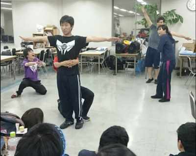

朝からおはようございます。今回のブログは四回生のあきらです。久々に役者させていただいてます。

そしてタイトルは特に意味はありません。たけのこ食べながら文章考えてました。美味しいですもぐもぐバンブー。

今日の稽古参加人数は三チーム合計35人でした！めっちゃ多い！たのしい！

ポートレートをやったということで、本日(昨日)の写真はお題『タイタニック』のポートレートです。ちゃんとえんだぁぁぁぁぁしてますね！

あ、えんだぁぁぁぁぁしてるさとしと隠れちゃってるけど後ろで支えているカルピス、どちらもイリエッティチームではないです悪しからず(笑)

(あとトメィトのブログと写真被ってしまいましたが気にしないでいきます。)

さて！役者選考終わってはじめての稽古、三チーム一緒に基礎連した後はひたすら段取り確認していました！

それっぽい事言いつつ出捌けしたりしなかったり、出来るだけ舞台上に居座ろうとする自己主張の激しい人がいたり、代役の代役を頼んだり、特にネタシーンでもない所に茶々を入れていったりとわいわいがやがやしながら楽しく確認していきました！

まだまだ夏は始まったばかり！これからどう化けていくかとても楽しみです(\*´ω｀\*)

以上、寝落ちした結果この時間にブログを書いていたあきらからでした！気付いたらベッドで寝てましたスヤァ

さて音集めしましょうかねっ！
