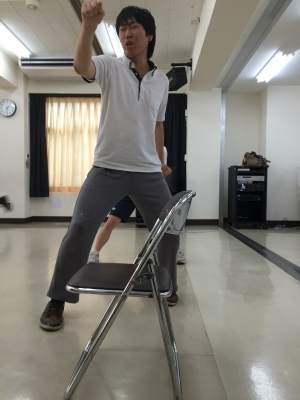

一回生 最後にまわってきたかごめです！

今日はひとが少なかったので基礎練習を色々しました

罰ゲームはおなじみの樽枝

逃れていても隣のひとの巻き添えにあって結局 今日は全員でしました！

つり橋エチュードや音パスなどなど基礎練習をしてからのシーンまわし＼(^o^)／はひとが少なかったのであまりできませんでしたがその代わり上回生に個人的に色々教えてもらえました

写真はシャトルランをしているデカソンです。

しんどかったです(´・ω・\`)

以上 何人もの上回生に教えてもらえて嬉しくて頑張ろうと思ったかごめでした！
