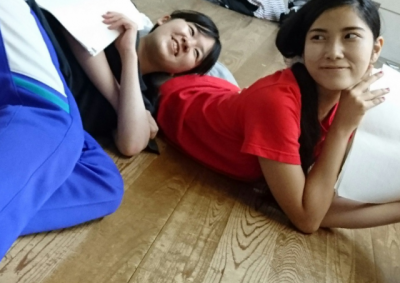

お疲れ様です、おはこんにちこんばんは！

ボケツッコミエチュードがやはり苦手なベルです。

ボケ殺しでなくボケ活かしと呼ばれたい。

昨日の稽古を振り返りたいと思います！

魔のテスト期間が終わり初めての稽古日。

テスト明けで久し振りという事で皆感覚が

少し抜けてしまっている印象でした。

甘い香りならぬケツ噛み判定厳しめの

"甘くない香り"では上回生も苦戦したり…

しかし!我等イリエッティチーム、球技大会も優勝した

身体能力も演技も強豪なチームですからねっ！

直ぐに感覚取り戻しきっと今日の稽古では

余裕余裕との声が聞こえる事でしょう！

その他の基礎練習は恒例セブンボウズと、

頭をフル回転させつつ劇を創るさ行禁止、

感情アウトプットな喜怒哀楽エチュードをしました！

どの基礎練習においても真剣ながら

笑いも沢山でとっても楽しいですね！

そしてその後はドレスパーティをしました！

演出さんと衣装チーフさんがじっくり

検討してなさってるのを見ていて、

衣装を「着るだけ」でなく「着こなせる」

ように役作りを頑張ろうと思いました！

因みに今日もあります。しっかり考察ぅ！

暑"い"ですが熱量で太陽押し退けてやる！

以上、稽古前から常時汗だくなベルでした！

写真は自主練習中の２回生・みりんと私！

実力上限未知数な彼女の演技、注目です！
