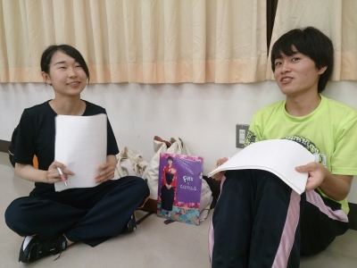
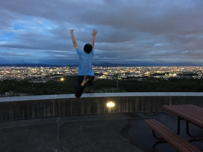

おはようございます_。

そしてお久しぶりです、やおうです。

ついに８月ですねー！そして当然ですがすっごく暑いですね！

セミがギャンギャン鳴いて、外は強い陽射しと灼熱地獄…。

夏がきたーっ！って感じがします！

これから夏本番が始まります！夏バテなんてしてる場合じゃねぇ！！

本番に向けて一層頑張っていきます！！

さて、昨日は芥川公民館での稽古でした！

セミともあっつい陽射しともおさらばの稽古でした。最高でした。毎日公民館がいいです。

そして、ついに本格的に台本を外しての稽古が始まりました！みんなテスト休みを挟んでセリフが抜けてたりして、演出は激おこでした。

僕も笑ってましたが、明日は我が身。精進します…！

さて、先も書きましたがこれから夏本番！

みなさんも夏バテと熱中症にはお気をつけて！

それでは本番でお会いしましょう！

その日が来るまでみなさんどうかお元気で！！

写真はシーンの話し合いをする一回生's！

この2人がどんなシーンを演じるのか今から楽しみですね～

## ８月１日晴れ

あんまり焼く気がないので、炎天下の日差しの下には居たくないです。

らむです。

今日から８月です！とくにどうと言うわけではないですが、

なんか

うわーーっ！！！

って感じます。早いものです。

今日は学校稽古でした。

テスト期間を挟んだので久しぶりの学校稽古！

いつもの発声場所の雑草が綺麗に刈り取られ、快適でした。

暑かったですが！

８月に入り、台本を離してのシーン回しになり だんだん感情がのっていく様子を見ているとワクワクしてきます。

台本が離れるとここからは とても早いですよ！成長！

本番に向けて 体力も筋力もつけながら頑張ります！

あしたは校外へランニングです。

じょじょ苑の演出にも 「一緒に走ろうよ」と声をかけたところ、２チーム合同で走ることになりました！楽しみです！

暑いですが！

早く寝てあしたに備えます。

お休みなさい！らむでした。
