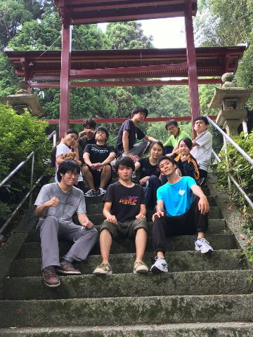

皆さんどうも。4回生のゆずこです。

はい！夏公といえば！そう！我がチームは今日じょじょえんチームと共に走りました！！(私は走っておりません。)炎天下の中、皆暑さと戦いながら走ったのでしょう…。今の時期、しっかり水分補給しましょう！大道具作業をしに学校に着く頃には皆すでに走り終えていました。

最近天候にも恵まれ大道具作業もはがどります！！

そしてもうすぐ我がチームはチームTシャツが届きますよ～！今年もゆずこデザインさせてもらいました！広報さんが素敵に仕上げて下さいました…。ありがとうございます…。

さてさて、そんなこんなで久々に稽古を見たら1回生も上回生もとても張り切って頑張っておりました！完成がとても楽しみです…！！！暑さに負けず、熱中症には十分気を付けて夏公乗りきっていきましょう！
