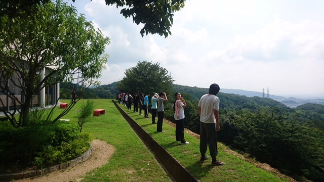

連日の暑さにやられ気味の二回生、みりんです。

今日も暑かったですね！今日の稽古は途中から外だったんですが、ジリジリと焼かれていく感覚が辛いです。汗もかきますので、水分だけでなく適度な塩分も取っていきましょう！

セリフ締め切りはとっくに過ぎているんですが、まだまだ覚えきれてない人がちらほら…。私もいざという時に次のセリフがとんでしまうことがあります。通しもあるので完璧にしておきましょう！

みなさん熱中症には気をつけて！今日の担当、みりんでした。
