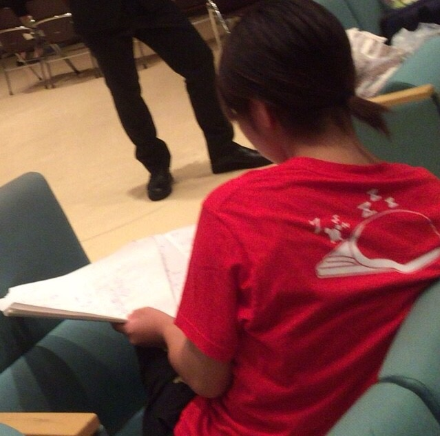

こんばんは、iPhoneSEに変えました、アルゴです。

今日はドレリハをしました。みんな衣装に包まれて、いよいよ本番へ。という感覚がついてきたでしょうか。

今日はOBOGが3人も来てくださいました。しかも、自分たち4回生が1回生のときの4回生。つまり１７期の方も来てくださいました。

ありがとうございました！

自分も4回なので、ふとOBになったら、、とか考えます。そりゃ稽古場には顔を出すつもりですが、稽古見に行ったら仲よかった後輩が知らん人らと絡んでて、しかも先輩として指導してる存在になってて。。

どんな感覚なんでしょうか。しかもこれが3年くらいたつといよいよ知ってる人が数人になっちゃう。んー、想像できないですねぇ。

いずれ来る必然ですから逃げようもないんですが。

諸先輩方も散々いうてましたが、今の俺たち20期が卒業したら21期が最上回になって、その次は22期がなって、23期が、、、と流れていく。

信じられないっすね

何がって、今の後輩後輩してる人たちが来年、再来年の万絵巻を引っ張る存在になるってことですよ

そりゃ時が来たらちゃんとしとくれるんですが、今はほんまかぁ？（笑）って感じです。

それと同時に、逆に俺(たち)はどうなんやろうか とかも考えます。

後輩は俺らから何か学んでるんやろうか？何か吸収していってるんやろうか？俺らはちゃんと先輩できてるのか？間違った方向に進めてないか？どうなんだ？？ってな感じで。

俺らが先輩から学んだ様々なこと。プラス20期のあれやこれや。

伝えれるんでしょうか。あと数ヶ月で。夏公なんであとほぼ1週間で。

俺らはなんか残せてるんかなー。残せてるモノがある。といいですね。

もうそんな時期かぁ。てかあと1週間か！！仕込みとか抜いたらもう1週間やん！！

はい、というわけで頑張りましょう！あと1週間(くらい)！

写真は、うちのチームの演出です。ちゃんと演出して、先輩してます。

たぶんブログ書く順番的にもう俺が回ることはない、、かな？なのでここだけの話、他のチームのことはわかりませんが、ここは結構良いチームですよ。各回生が積極的に参加してくれる。それぞれが努力してる。

最後の夏、ここで良かったかな。

と、思いました。

iPhoneSEから送信したアルゴでした。

では、またいつか。
